# 操作系统LAB3实验报告

## 一.思考题

### 1.请结合 MOS 中的页目录自映射应用解释代码中 e->env_pgdir[PDX(UVPT)] = PADDR(e->env_pgdir) | PTE_V 的含义。 

UVPT是kuseg中保存用户（当前进程）页表信息的虚拟内存区，大小为4MB（0x7fc00000-0x80000000），PDX(UVPT)取UVPT前10位，代表着UVPT位于第几个4MB内存区，而e->env_pgdir[PDX(UVPT)]即当前进程的页目录的第PDX(UVPT)项，写入当前页目录的物理地址并置入有效位，意义即完成自映射，当访问UVPT这一虚拟地址时，通过页表转换，可以得到页目录的物理地址。

### 2.elf_load_seg 以函数指针的形式，接受外部自定义的回调函数 map_page。 
### 请你找到与之相关的 data 这一参数在此处的来源，并思考它的作用。没有这个参数可不可以？为什么？

data来自kern/env.c的load_icode函数中，他的作用在于传递当前的进程块结构体的指针。我认为没有这个参数不可以，因为lib/elfloader.c中elf_load_seg还需要将data传递给map_page函数中(即load_icode_mapper)，涉及到跨文件的指针传递，作为参数传递应该是最好的选择。
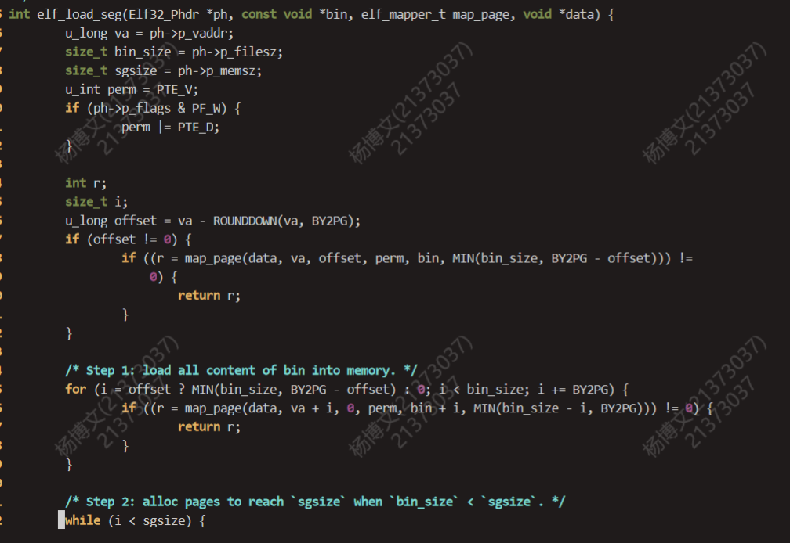
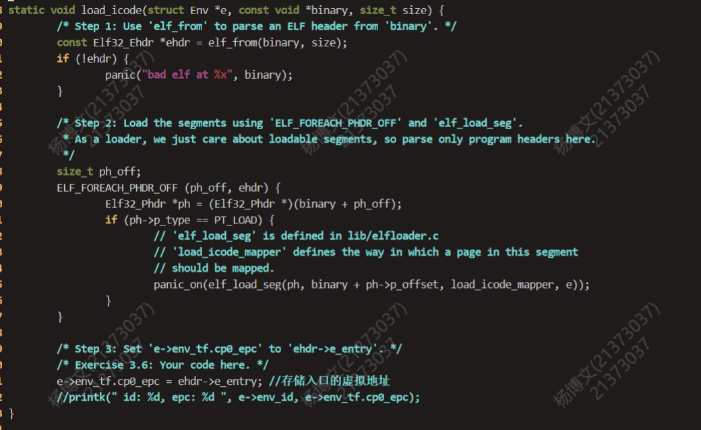
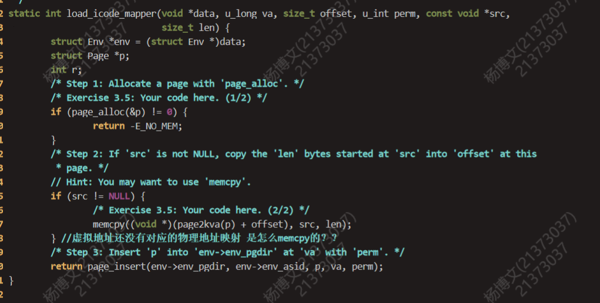

### 3.结合 elf_load_seg 的参数和实现，考虑该函数需要处理哪些页面加载的情况。

一共要考虑va，va+bin_size,va+sg_size三个地址和对齐的一页的位置关系。(借用一下H哥的图555)
#### va和va+bin_size一共有六种情况
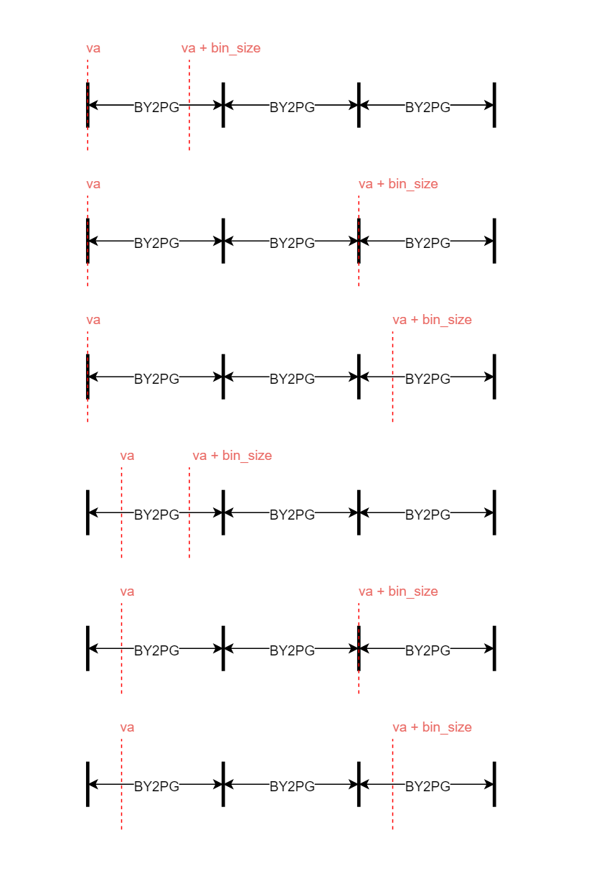
#### va+bin_size和va+sg_size一共有六种情况

### 4.你认为这里的 env_tf.cp0_epc 存储的是物理地址还是虚拟地址?

虚拟地址，用户进程接触到的地址都应该是虚拟地址。

### 5.试找出上述 5 个异常处理函数的具体实现位置。

0号异常的处理函数为handle_int，在kern/genex.S中实现。
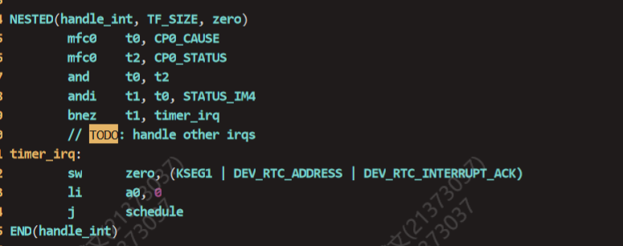

1号异常的处理函数为handle_mod，23号异常的处理函数为handle_tlb，8号异常的处理函数为handle_sys，都是通过genex.S文件中的宏函数BUILD_HANDLER实现的
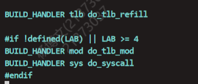
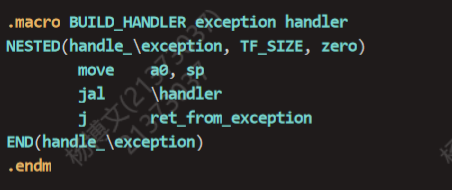

### 6.阅读 init.c、kclock.S、env_asm.S 和 genex.S 这几个文件，并尝试说出enable_irq 和 timer_irq 中每行汇编代码的作用。

enable_irq：
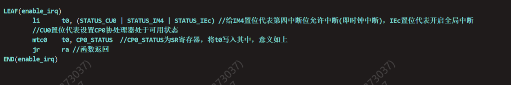

timer_irq:
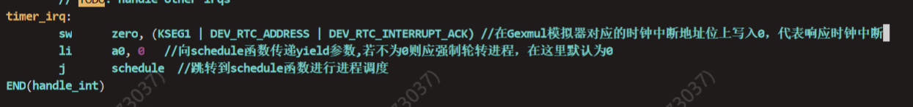

### 7.阅读相关代码，思考操作系统是怎么根据时钟中断切换进程的。 

env_sched_list有一个双向队列存放就绪进程。当进程被创建时，我们将其插入队列的头部。

当时钟中断来临时，陷入内核，内核经由handle_int分配给schedule函数调度进程。首先让当前进程的时间片减1，然后有四种情况需要切换进程。
* 当前进程为空
* 当前进程剩余时间片为0
* yield不为0
* 当前进程不再处于就绪状态

若切换进程，且当前进程不为空，则将当前进程在env_sched_list队列头部移除，若仍处于就绪状态，则再将其插入队列的尾部。接着依据当前队列头部进程的优先级分配新的时间片(即一常数)，并运行该头部进程。
若不需切换进程，则运行原本进程即可。

运行进程即env_run，在env_run中，完成下述操作完成进程切换的预备工作。在用户空间KSTACKTOP以下的一个 sizeof(TrapFrame)用来保护当前进程的上下文信息。
1. 保存当前进程的上下文信息。
2. 切换 curenv 为即将运行的进程。
3. 设置全局变量 cur_pgdir 为当前进程页目录地址，在 TLB 重填时将用到该全局变量。
4. 调用 env_pop_tf 函数，env_pop_tf 再调用 ret_from_exception 函数，恢复现场、异常返回。

最后回归到用户态，执行切换后的进程的代码(若没有切换进程也会调用env_run，只不过保存现场等操作做了一番无用功罢了)。
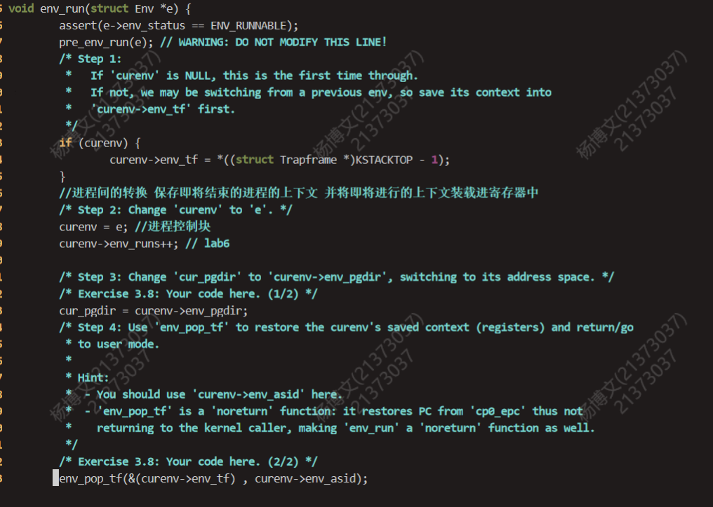

## 二.实验难点分析

我认为本次实验的难点与LAB2相似，即理解清楚各函数间的调用关系以及理解这些函数组合起来完成最终的用途是本实验的最大难点。大致分为两部分，**进程的建立**与**进程的切换与调度**。借用指导书的图进行细致分析。
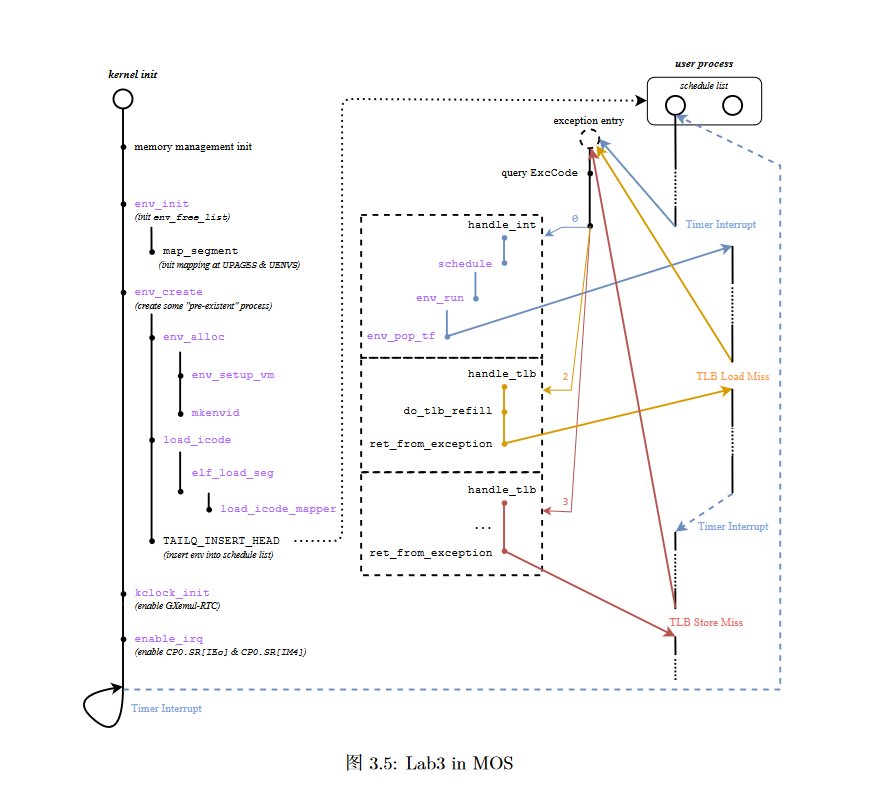

### 1.进程的建立

本LAB进程的建立发生在内核的初始化过程中，即在初始化内核的同时完成了两个进程的建立，步骤如下。
1. 通过 env_init 函数完成进程控制块的初始化，完成空闲进程块链表和调度队列的初始化，并且完成模板页表的构建。
2. 调用 env_create 函数完成一个进程的创建，具体来说首先通过 env_alloc 申请一个空闲PCB，完成参数初始化，并通过 env_setup_vm 函数完成进程页表初始化与自映射。
3. 调用 load_icode 等一系列函数将二进制ELF文件加载进进程虚拟空间中，最后将该PCB装入调度队列中，准备调度。
4. 时钟初始化并开启时钟中断，等待第一个时钟中断来临，开始第一次的进程调度。

### 2.进程的切换与调度

详情参见思考题7。

## 三.实验感受

LAB3我们主要完成了进程的初始化，异常中断处理与时间片调度的操作，综合感受下来较LAB2简单一些。

本次实验总计用时7~8小时，主要在两个地方出现了Bug并折磨许久，其一是申请asid时传入的未经初始化的指针会报错，无法获得asid，但是提前初始化好指针又不够优雅，为此我重新学习了一遍C语言指针传参相关的内容，收获甚微。我最后认为可能是由于编译器版本的问题，DEVC上运行便能正常传参，因此最后还是无奈选择了先随便初始化后再传入指针的方法。其二是在进程调度时仅考虑了需要进程切换的情况，忽视了无需切换进程时也应让当前进程继续运行的操作，导致运行结果永远只有一行。当我发现了只有env_run才能使其从内核态返回用户态时，该问题也便迎刃而解了。

总体而言，本次LAB3令我收获颇丰，理解了进程的相关操作，并动手实践完成了代码。然而在为进程初始化虚拟空间时，对于虚拟空间和虚实转化的一些知识仍然抱有疑问，比如为什么页p总是可以使用page2kva转化为内核虚拟地址。笔者将在日后的学习过程中继续钻研，争取早日开悟操作系统。