# 操作系统LAB4实验报告

## 一.思考题
### 1.思考并回答下面的问题：
• 内核在保存现场的时候是如何避免破坏通用寄存器的？
• 系统陷入内核调用后可以直接从当时的 \$a0-\$a3 参数寄存器中得到用户调用 msyscall
留下的信息吗？
• 我们是怎么做到让 sys 开头的函数“认为”我们提供了和用户调用 msyscall 时同样
的参数的？
• 内核处理系统调用的过程对 Trapframe 做了哪些更改？这种修改对应的用户态的变
化是什么？

(1)每当发生异常需要进入内核时，OS都会先使用SAVE_ALL将上下文保存进Trapframe中，其中便包括32个通用寄存器，具体来说，首先将指向用户栈的sp赋值给k0，再将32个寄存器及其他保存，最后将sp指向Trapframe的栈顶。在返回用户态时再调用ret_from_exception，首先执行RESTORE_SOME宏将寄存器内容归还，再将k0赋值上EPC，再将sp指向原先的用户栈，最后返回用户态，实现了对通用寄存器(除k0,k1)的保护。

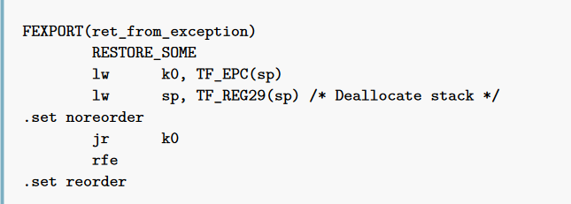

(2)可以，系统陷入内核后\$a0~\$a3寄存器没有发生变动，即使它们也被保存进了Trapframe中，因此自然可以通过直接使用a0到a3来获取参数。但是仅局限于刚进入内核态，在执行handle_sys之前可以，因为在handle_sys中，为给do_syscall传参，\$a0被赋予了*tf的值。

(3)通过在刚进入内核态就拷贝好的Trapframe，do_syscall从Trapframe中获取参数并传递给sys_*。

(4)主要更改了两个地方，第一更改了epc，具体来说令其加4，即返回用户态时继续执行系统调用后的**下一条**指令；第二更改了\$v0，系统调用得到的结果(若有)存放于\$v0中，以供用户态使用。整体对用户态来说就像是执行了一个普通的有返回值的函数一般。

### 2.思考 envid2env 函数: 为什么 envid2env 中需要判断 e->env_id != envid的情况？如果没有这步判断会发生什么情况？ 

笔者也不确定，也许是为了防止用户访问其他的进程而作出的保护。

### 3.思考下面的问题，并对这个问题谈谈你的理解：请回顾 kern/env.c 文件中 mkenvid() 函数的实现，该函数不会返回 0，请结合系统调用和 IPC 部分的实现与envid2env() 函数的行为进行解释。

makenvid中返回的envid永远不会是0，这是由于在envid2env函数中，传进来的envid为0时，返回的是当前进程的进程块，这样避免了进程块冲突。

因为在用户态下无法直接得到当前进程块指针，因此在用户态下处理写时复制，以及执行fork时会出现得不到curenv的情况(就本LAB而言)。用户态下系统调用时给envid传入0的意思便是使用当前进程控制块，便于系统调用访问。当然一些其他的情况使用0也更加的简单便捷。

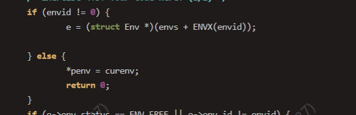

### 4.关于 fork 函数的两个返回值，下面说法正确的是：
* A、fork 在父进程中被调用两次，产生两个返回值
* B、fork 在两个进程中分别被调用一次，产生两个不同的返回值
* C、fork 只在父进程中被调用了一次，在两个进程中各产生一个返回值
* D、fork 只在子进程中被调用了一次，在两个进程中各产生一个返回值 

选C。

### 5.我们并不应该对所有的用户空间页都使用 duppage 进行映射。那么究竟哪些用户空间页应该映射，哪些不应该呢？请结合 kern/env.c 中 env_init 函数进行的页面映射、include/mmu.h 里的内存布局图以及本章的后续描述进行思考。 

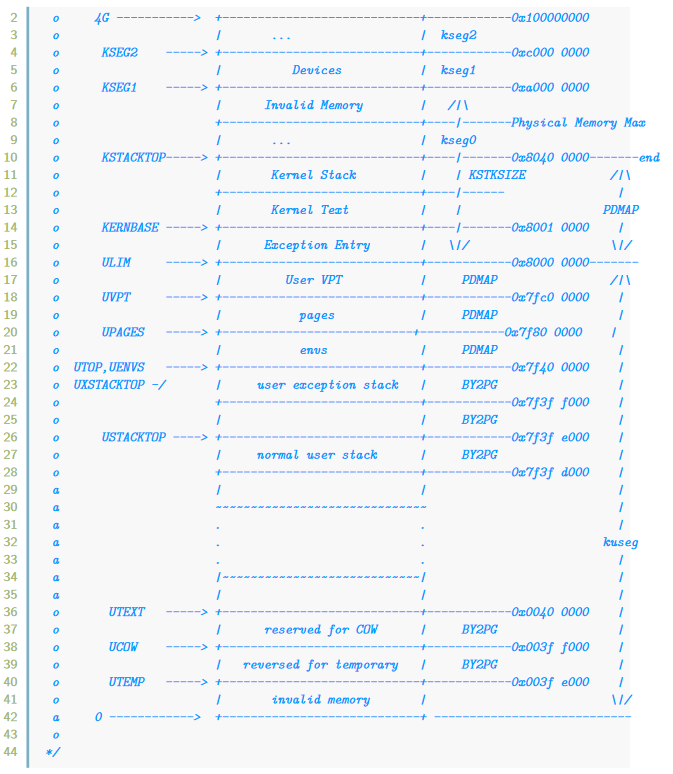
内核内存部分不需要映射，所有进程共享。

UTOP和ULIM之间储存三部分内容，分别是总进程控制块信息，总物理页面信息，以及当前进程和内核相关的页表信息。在执行env_alloc()函数时，这一部分的映射关系直接从base_pgdir拷贝到进程页表中，因此不需要进行映射。

    memcpy(e->env_pgdir + PDX(UTOP), base_pgdir + PDX(UTOP), sizeof(Pde) * (PDX(UVPT) - PDX(UTOP)));
    e->env_pgdir[PDX(UVPT)] = PADDR(e->env_pgdir) | PTE_V;

USTACKTOP到UTOP间是用户态下的异常处理栈和无用内存，父子进程显然不需要共享这部分内存。

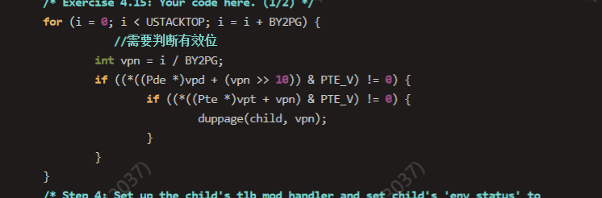

因此如图所示，只需映射USTACKTOP以下的有效的页面。

### 6.在遍历地址空间存取页表项时你需要使用到 vpd 和 vpt 这两个指针，请参考 user/include/lib.h 中的相关定义，思考并回答这几个问题：
• vpt 和 vpd 的作用是什么？怎样使用它们？
• 从实现的角度谈一下为什么进程能够通过这种方式来存取自身的页表？
• 它们是如何体现自映射设计的？
• 进程能够通过这种方式来修改自己的页表项吗？

(1)vpt指二级页表首地址的虚拟地址，即UVPT；vpd指页目录首地址的虚拟地址，即UVPT + (PDX(UVPT) << 12)，可以用来对用户页表和页目录进行访问。以vpt为例，使用时先将其转化为指针形式，然后加上虚拟地址的页号，得到的地址中存储的便是对应的物理页号，再按地址进行读取即可。

(2)因为vpt经由页表映射到了页表的首地址，vpd经由页表映射到了页目录的首地址。

(3)页表自映射，即把所有页目录表和页表映射到一个连续的4MB虚拟地址空间中。在内核态中，访问页目录通过e->pgdir即可，因为在内核态下经由page2kva转换后可不经页表直接访问物理地址，而在用户态下访问页表需要经过页表转换，这时候vpt就派上用场了，我们早在给进程页表初始化时便完成了自映射的设计，即

    e->env_pgdir[PDX(UVPT)] = PADDR(e->env_pgdir) | PTE_V

这样我们可保证访问虚拟地址[UVPT，UVPT+4MB)即是访问当前进程的页表。

(4)不能，用户态下对页表只能读不能写。

### 7.在 do_tlb_mod 函数中，你可能注意到了一个向异常处理栈复制 Trapframe运行现场的过程，请思考并回答这几个问题：
• 这里实现了一个支持类似于“异常重入”的机制，而在什么时候会出现这种“异常重入”？
• 内核为什么需要将异常的现场 Trapframe 复制到用户空间？

(1)当父子进程需要对一个页面进行写操作时，会触发写时复制机制，这个时候陷入内核，在do_tlb_mod函数中进行配置(拷贝TF，设置a0和epc)后，跳转到用户态进行处理。

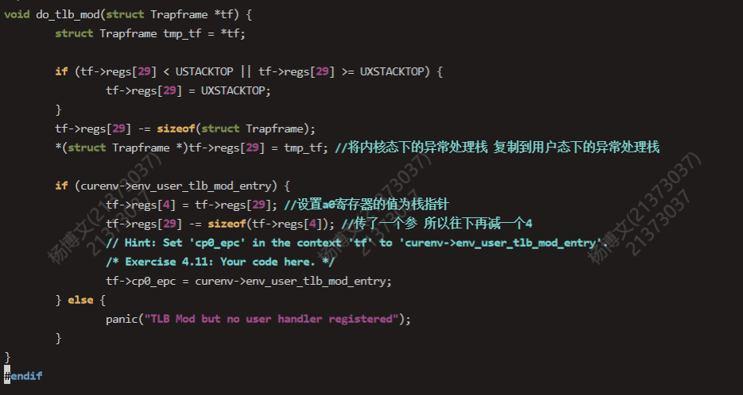

**补充**:笔者前面理解的不是很到位，"异常重入"应当是说，在COW_ENTRY执行过程中又写入了带有一个PTE_COW位的页面，又要进入内核态进入tlb_mod异常处理，又调用COW_ENTRY，如此反复......发生了"重入"的现象。

(2)因为写时复制异常的真正处理是在用户态进行的，而用户态只能访问用户空间（低2G空间）内的数据，所以需要将现场保存在用户空间下。

### 8.在用户态处理页写入异常，相比于在内核态处理有什么优势？

尽量减少内核出现错误的可能，即使程序崩溃，也不会影响系统的稳定。同时微内核的模式下，用户态进行新页面的分配映射也更加灵活方便。

### 9.请思考并回答以下几个问题：
• 为什么需要将 syscall_set_tlb_mod_entry 的调用放置在 syscall_exofork 之前？
• 如果放置在写时复制保护机制完成之后会有怎样的效果？

syscall_set_tlb_mod_entry 如果放置在写时复制保护机制完成之后会导致在父进程进行 duppage 的设置过程中遇到的 COW 缺页异常无法得到正确的处理，即在执行 syscall_set_tlb_mod_entry 之前就会发生 写时复制异常 ，此时还没有相应的 handler 进行处理，系统就会出现问题。

## 二.实验难点

本LAB介绍了系统调用，并重点实现了进程间通信与fork函数，在其中又涉及了大量的系统调用函数。本次实验难点较多，在此重点介绍系统调用流程和fork函数的实现流程。

### 1.系统调用流程
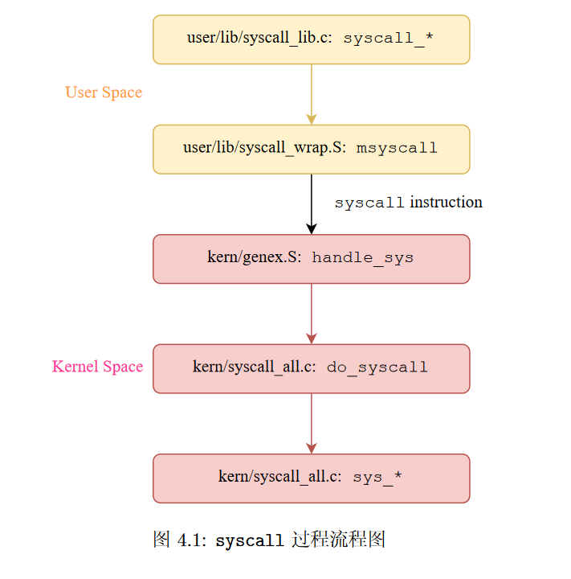

__syscall\_\*__，调用msyscall(参数)，根据不同的syscall统一使用msyscall传递不同的参数 -> 
__msyscall__，汇编文件，使用syscall进入内核 -> 
**用户态内核态分界线**
__entry.S__，进入内核入口，SAVE_ALL保存现场，并根据CP0_CAUSE中异常码分配给不同的handle_*函数，在本lab中处理中断异常为handle_sys ->
__handle_sys__，将\$a0赋值Trapframe指针，并调用do_syscall -> 
__do_syscall__，从Trapframe中获取msyscall传入的参数，根据取到的第一个参数即系统调用号获取对应的sys_\*函数并传入参数调用 ->
__sys\_\*__，具体实现系统调用的流程，将函数结果返回do_syscall ->
__do\_syscall__，将返回结果保存到Trapframe(\$v0)处，并返回至handle_int -> 
__handle\_int__，调用ret_from_exception，恢复现场，并返回至用户态，即返回至msyscall ->
__mysyscall__，执行jr \$ra，返回上层，继续用户态进程执行。

整体系统调用流程，或者说异常处理流程大致如上。

### 2.fork函数流程

fork函数作用为在当前进程下创建一个子进程，流程如下(不得不说课程组的流程图制作的很用心，感动坏了)。

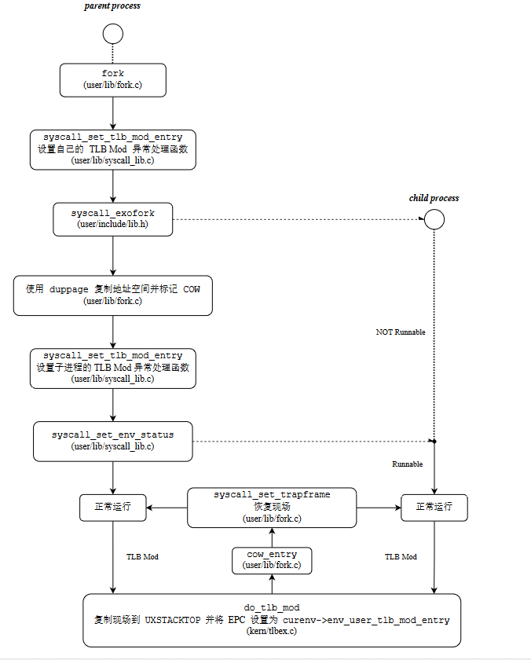

sys_exofork:
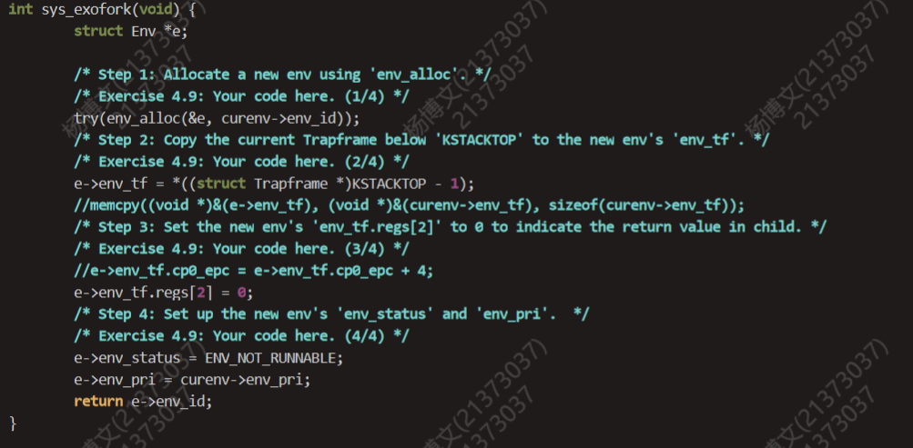

该函数申请一个进程块，并为子进程初始化基本信息，包括继承父进程优先级，设置进程状态等，其中**e->env_tf.reg[2]=0，即设置该进程块Trapframe(\$V0)处为0，这点是区分父子进程最关键的地方**，由于子进程将当前Trapframe拷贝进进程块中，而Trapframe中Epc的位置即返回到用户态的位置，所以**结合LAB3，当子进程被调度时将直接执行返回用户态后的第一条语句，即将返回值\$v0=0赋值给child，而父函数会执行sys_exofork至结束并返回子进程id，由此区分出来了父子进程**。

fork:
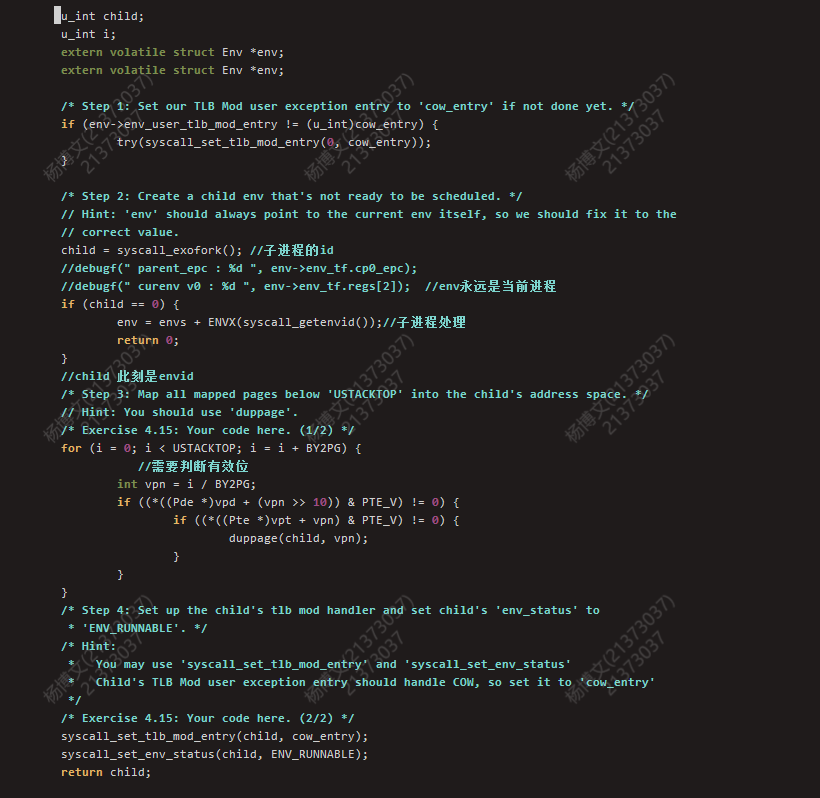

进程调用fork函数，首先为父进程设置写时复制函数，并执行syscall_exofork函数创建出还无法调度的子进程，接着为父子进程页表通过COW位设置写时复制机制，最后为子进程设置写时复制函数并使子进程就绪，等待对子进程的调度。

### 3.写时复制

经由fork设置，当父子进程在运行时首次写写时复制页面时，会陷入内核触发tlb_mod异常，但该异常处理仅是设置了参数并将其交给用户态的cow_entry函数真正处理。

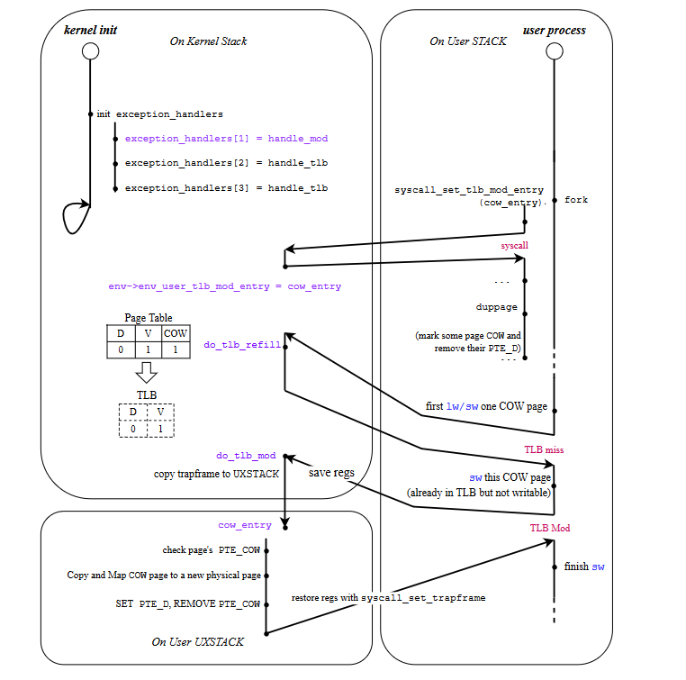

在cow_entry中，使用了UCOW实现了**间接复制**，即将新分配的物理页面与UCOW映射，并通过memcpy将va拷贝到UCOW中，再使用syscall_mem_map将va与UCOW映射到同一物理页面并最后解除物理页面与UCOW的映射，经过一波互换操作完成了va与另一个与原先内容一致的物理页面的映射。

### 4.进程间通信

由于在LAB5中大量使用到进程间通信，在此简要说明，主要由发送和接受两个函数实现。

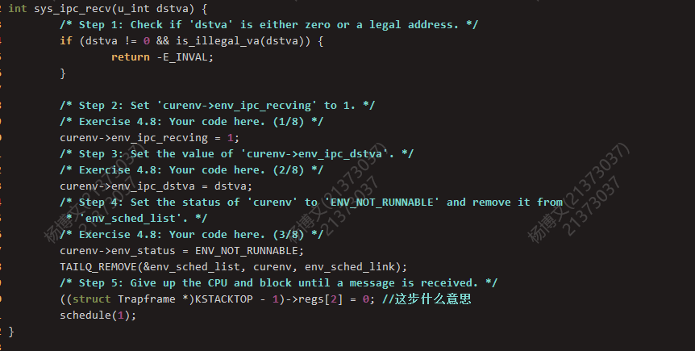
recv函数：

接受方进程(文件服务进程)采用轮询的方式调用该函数，传递进待映射的虚拟地址，在该函数中，将等待发送位置1，同时阻塞该进程，移除调度队列，并立即调度其他进程，等待发送进程进行信息的发送。

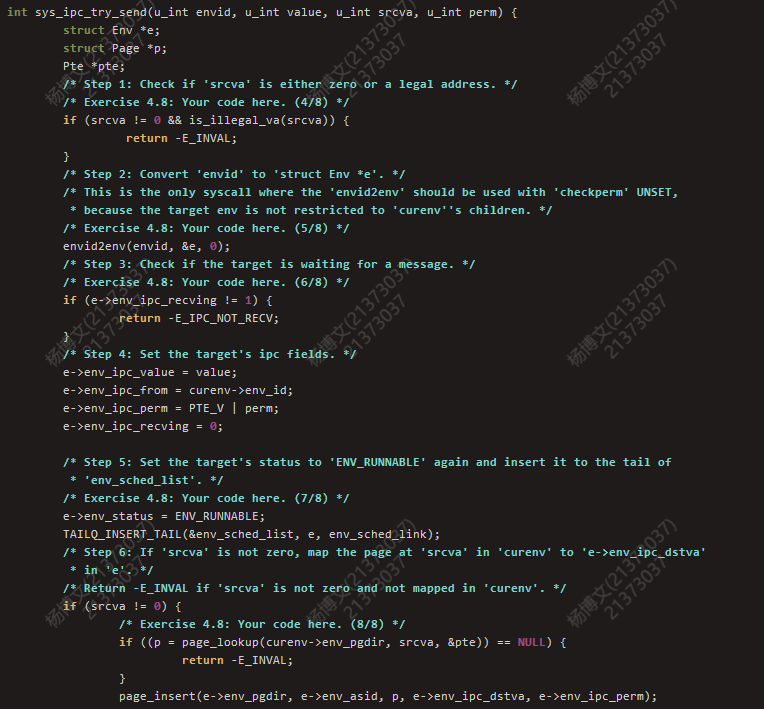
send函数：

发送方进程将接收方进程Id，待发送的值，待映射的虚拟地址，权限位传入该函数，首先检验接收方进程的等待发送位，若为0，则调度其他进程，等待轮转到发送方进程时再次尝试发送，若为1，则进行value的传递和页面的映射(若发送方虚拟地址为0代表只传递value)，并将接受方进程解除阻塞，重新加入到调度队列中。通过内核态实现了对非本进程的地址的映射以及进程控制块的修改，当调度到接收进程时，该进程已经收到了发送方进程传来的信息。

## 三.心得体会

LAB4主要完成了系统调用相关函数的实现，并完成了一个巨大无比的fork函数的实现，数十个函数相互调用配合，一环套一环，有共同之处，比如陷入内核分发异常以及返回用户态的流程，但是更多的是不同，如分发异常后继续分发系统调用码以及种种，复杂度较之前大幅度提高，且debug难度也直线上升，笔者包括实验报告总计用时15小时左右，且写文章至此身心俱疲，渴望睡觉。

不得不说每次写实验报告都要花比写LAB更多的时间，写代码时总是关注着把当前函数写的无纰漏，最多考虑前后的一两个函数调用搭配，而写实验报告时则要关注整体的流程以及给出的代码中隐藏的细节，当静下心来细细思考时，仔细研读给出的每一行代码时，才会更加大悟操作系统的魅力，笔者愚笨，学到如今只觉得震撼。

晚安世界。

当要复制另一个物理页面并建立用户虚拟地址与一个新物理页面的映射时，我们通常采用将新物理页面转化为内核态虚拟地址page2kva，再使用memcpy拷贝，最后将新物理页面与用户虚拟地址映射page_insert。