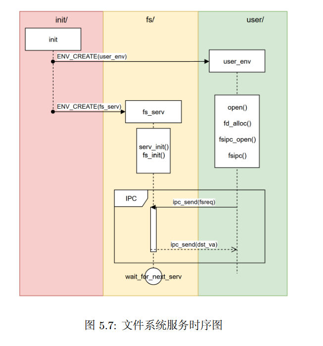
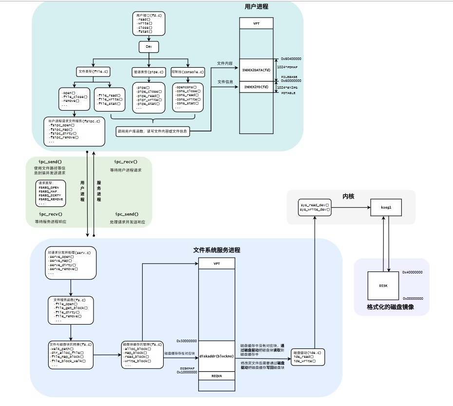

# 操作系统LAB5实验报告

## 一.思考题

### 1.如果通过 kseg0 读写设备，那么对于设备的写入会缓存到 Cache 中。这是一种错误的行为，在实际编写代码的时候这么做会引发不可预知的问题。请思考：这么做会引发什么问题？对于不同种类的设备（如我们提到的串口设备和 IDE 磁盘）的操作会有差异吗？可以从缓存的性质和缓存更新的策略来考虑。 

当我们与内存交互时使用Cache没有问题，因为内存中的数据只依赖CPU的写操作而改变，使用Cache可以保证访存数据一致性；而当我们与外设交互时，由于外设中的数据的更新并不只依赖于CPU的写操作，还会由外设自己更新(比如计时器的中断位)，这会导致出现**缓存数据和此刻实际外设数据不一致的情况**，即Cache里仍是老数据，而实际的数据外设自身已经更新却无法及时通知给Cache。

有区别，串口是**字符设备**，只支持顺序读取，无需经过缓存，直接以字符（字节）为单位进行读写；而IDE磁盘是**块设备**，支持随机读取。**内存是磁盘的缓存**，如LAB5文件服务进程将磁盘空间映射到进程虚拟空间中，在访问块设备时会经过内存这一层缓存，更高效的对数据进行访问。

### 2.查找代码中的相关定义，试回答一个磁盘块中最多能存储多少个文件控制块？一个目录下最多能有多少个文件？我们的文件系统支持的单个文件最大为多大？

一个磁盘块与一页大小相同，为4KB，一个文件控制块大小BY2FILE=256B，因此一个磁盘块最多存储16个文件控制块。

    struct File {
        u_char f_name[MAXNAMELEN];	
        u_int f_size;			
        u_int f_type;			
        u_int f_direct[NDIRECT];
        u_int f_indirect;
        struct File *f_dir;		
        u_char f_pad[BY2FILE - MAXNAMELEN - 4 - 4 - NDIRECT * 4 - 4 - 4]; //对齐
    };

一个目录下最多拥有直接指针 + 间接指针指向的1024个磁盘块，每个磁盘块可以存储16个文件，共能存储16384个文件。

同理，一个普通文件最多也可指向1024个磁盘块，最大容纳数据为1024*4KB=4MB。

### 3.请思考，在满足磁盘块缓存的设计的前提下，我们实验使用的内核支持的最大磁盘大小是多少？ 

文件服务进程将 DISKMAP 到 DISKMAP+DISKMAX 这一段虚存地址空间 (0x10000000-0x4fffffff) 作为缓冲区，可计算得出内核最大支持1GB的磁盘，而本实验磁盘大小仅仅为1024*4KB=4MB。

### 4.在本实验中，fs/serv.h、user/include/fs.h 等文件中出现了许多宏定义，试列举你认为较为重要的宏定义，同时进行解释，并描述其主要应用之处。

serv.h:

    #define PTE_DIRTY 0x0002 //脏位 用来判断内存中的磁盘内容需不需要写回磁盘
    #define DISKNO 1 //磁盘号 固定为1
    #define BY2SECT 512  //一个扇区大小 512字节
    #define SECT2BLK (BY2BLK / BY2SECT) //一个磁盘块有8个扇区
    #define DISKMAP 0x10000000 //磁盘映射的起始虚拟地址 针对文件服务进程
    #define DISKMAX 0x40000000 //磁盘映射空间大小

fs.h:

    #define BY2BLK BY2PG  //磁盘块大小 与一页相等（字节）
    #define BIT2BLK (BY2BLK * 8) //磁盘块大小（比特）
    #define MAXNAMELEN 128 //文件名最大长度
    #define MAXPATHLEN 1024 //路径名最大长度（包含数个用/连接的文件名）
    #define NDIRECT 10 //直接指针数量
    #define NINDIRECT (BY2BLK / 4) //间接指针数量 一个指针4字节 一个磁盘块BY2BLK字节
    #define MAXFILESIZE (NINDIRECT * BY2BLK) //文件最大大小
    #define BY2FILE 256 //文件控制块大小

    struct File {
        char f_name[MAXNAMELEN]; // 文件名
        uint32_t f_size;         // 文件大小       uint32_t f_type;         // 文件类型，目录文件或普通文件
        uint32_t f_direct[NDIRECT]; //直接指针
        uint32_t f_indirect; //间接指针 指向另一磁盘块
        struct File *f_dir; // 指向自己的上级目录（当此控制块可用时）
        char f_pad[BY2FILE - MAXNAMELEN - (3 + NDIRECT) * 4 - sizeof(void *)]; //填充
    } __attribute__((aligned(4), packed));
  
    #define FILE2BLK (BY2BLK / sizeof(struct File)) //一个磁盘块可容纳多少文件控制块 16

    #define FTYPE_REG 0 // Regular file
    #define FTYPE_DIR 1 // Directory

    #define FS_MAGIC 0x68286097 // Everyone's favorite OS class 魔数

    struct Super {
        uint32_t s_magic;   // Magic number: FS_MAGIC 魔数
        uint32_t s_nblocks; // Total number of blocks on disk 磁盘块数量
        struct File s_root; // Root directory node 根目录控制块
    };

主要应用在文件服务进程与磁盘镜像的交互中。

### 5.在 Lab4“系统调用与 fork”的实验中我们实现了极为重要的 fork 函数。那么 fork 前后的父子进程是否会共享文件描述符和定位指针呢？请在完成上述练习的基础上编写一个程序进行验证。

会共享文件描述符和定位指针，在serve_open中可以看到

    ipc_send(envid, 0, o->o_ff, PTE_D | PTE_LIBRARY);

即将文件描述符在用户虚拟空间映射的权限设置为 PTE_D | PTE_LIBRARY，在LAB4中我们知道这种页面是**不会被设置为写时复制**的，因此父子进程共享。

测试程序如下：

    void test()
    {   
        int r, fdnum, n;
        char buf[200];
        char *w = "yangbowen"; 
        fdnum = open("/newmotd", O_RDWR);
        n = write(fdnum, w, strlen(w));
        close(r);
        fdnum = open("/newmotd", O_RDWR);
        if ((r = fork()) == 0) {
            n = read(fdnum, buf, 4);
            debugf("child buffer is %s\n", buf);
        } else {
            n = read(fdnum, buf, 5);
            debugf("father buffer is %s\n", buf);
        }
    }
    ---------------------
    reselt:
    father buffer is yang
    child buffer is bowen
    ----------------------

### 6.请解释 File, Fd, Filefd 结构体及其各个域的作用。比如各个结构体会在哪些过程中被使用，是否对应磁盘上的物理实体还是单纯的内存数据等。说明形式自定，要求简洁明了，可大致勾勒出文件系统数据结构与物理实体的对应关系与设计框架。

    struct Fd {
        u_int fd_dev_id; //设备
        u_int fd_offset; //文件
        u_int fd_omode; //文件打开模式
    };

    struct Filefd {
        struct Fd f_fd;  //上述结构
        u_int f_fileid;  //文件特有id
        struct File f_file; //对应的文件控制块
    };

    File见前思考题

File结构体是文件控制块，用来在磁盘中存储文件信息，是磁盘上的物理实体，自然也会被读入文件服务进程中；其他是单纯的内存数据，保存在用户进程中，用户与文件交互的任何操作都要使用Filefd，其不仅包含了File，还包含了一些其他方便我们与文件进行交互的信息，比如id，位置，打开状态等，这些信息对于磁盘内文件来说是不需要的，只有当我们使用时才需要，因此文件系统数据结构设计成既包含物理实体，又含有用户信息的结构，服务进程使用File，用户进程使用Filefd。

file_id在与服务进程交互中使用，而在用户进程我们使用 fd2num 也可唯一的表示一个文件。

### 7.图5.7中有多种不同形式的箭头，请解释这些不同箭头的差别，并思考我们的操作系统是如何实现对应类型的进程间通信的。 

黑三角箭头且黑色实线，是同步消息

开三角箭头且黑色虚线，是返回消息

返回消息和同步消息结合使用时(黑框中IPC过程)，同步消息的发送者把进程控制权交给消息的接收者，然后暂停活动，等待消息接收者的返回消息，收到后继续执行。

在本LAB中同步消息的发送者是用户进程，返回消息的发送者是文件服务进程，用户进程通过 fsipc 函数，服务进程通过 serve_* 函数实现双向通信。服务进程通过轮询的方式不停探寻来自用户进程的发送信息，并根据请求号执行相应的操作，并返回信息。

    fsipc:
    static int fsipc(u_int type, void *fsreq, void *dstva, u_int *perm) {
        u_int whom;
        // Our file system server must be the 2nd env.
        ipc_send(envs[1].env_id, type, fsreq, PTE_D);
        return ipc_recv(&whom, dstva, perm);
    }

    serve:
    req = ipc_recv(&whom, (void *)REQVA, &perm);

    以serve_open为例:
    ipc_send(envid, 0, o->o_ff, PTE_D | PTE_LIBRARY);

## 二.实验难点

### 1.MMIO映射

我们访问外设是以访问其寄存器（控制寄存器、状态寄存器和数据寄存器）的形式进行数据通信的，每种外设都被映射到了指定的**物理地址空间**，我们使用KSEG1段的不经过Cache和MMU的虚拟地址来访问外设寄存器，通过简单的读写固定的内核虚拟地址即可实现驱动外设程序的功能。磁盘被映射到0x13000000。

### 2.文件系统结构

基于该图：

我们向用户进程提供了许多文件操作的接口，大致分为两类，一类是在用户进程就可完成的操作，比如 read，write，stat，seek 由于他们操作的信息已经存在于用户空间中；另一类是需要与文件服务进程交互的操作，即需要调用 fsipc_* -> fsipc 使用 IPC 与文件服务进程通信，而文件服务进程根据不同的操作码在serve中执行相应的操作。

    #define FSREQ_OPEN 1
    #define FSREQ_MAP 2
    #define FSREQ_SET_SIZE 3
    #define FSREQ_CLOSE 4
    #define FSREQ_DIRTY 5
    #define FSREQ_REMOVE 6
    #define FSREQ_SYNC 7

几个关键操作解析：

* write：调用 file_write（将内容写入内存）
  
* read：调用 file_read（从内存读取内容）
这两个操作不涉及与文件服务程序的交互

* open：申请一个文件描述符，并使用 fsipe_open 获得磁盘中对应的文件控制块(无对应路径则创建一个新的文件)，然后使用 fsipe_map 将磁盘内容读出到服务进程，再映射到用户进程虚拟空间中，方便读写。
  
* close：调用file_close ，使用 fsipc_dirty 告知文件服务进程需要写回的磁盘块（疑似是所有），再使用 fsipc_close 关闭这个文件，即找到该文件对应的所有磁盘块写回磁盘，最后取消文件和文件描述符在用户虚拟空间的映射，自然服务进程的映射同样取消。

* remove：调用fsipc_remove -> file_remove，将文件名清空，对应磁盘块释放，写回磁盘

* seek：找到对应的文件控制块，将其位置指针自定义，一般用来重置到文件头或尾

上述操作除 remove 皆用于**普通文件**，即是文件树的最底层，而 remove 需要对一棵文件子树进行处理。

## 3.一些机制

1. 先在服务进程空间中申请创建新文件，读写文件等，在close时再将其统一写回磁盘。

2. 不用担心用户进程和服务进程文件信息不同步，因为 fsipc_map 中使用的IPC将他们映射到同一物理地址空间上，只需考虑将内存中的文件写回磁盘即可。

3. 在我们实现的文件系统中，**读写共享一个位置指针**，因此在write之后若想读出，需要先将文件close后再open，或者使用seek重置到文件头。

4. tools/fsformat.c是一个镜像，用disk数组模拟了磁盘，镜像指将Linux下的文件拷贝到disk数组中，再输出到Linux环境下的某个文件里，可以在main函数中自由的指定拷贝路径以及输出路径等。这里面涉及到使用数组对磁盘的虚拟，以及Linux环境下的文件操作。

## 三.心得体会

操作系统实验即将结尾，在LAB5中，我们完成了一个简易的文件系统，并学习到了外设，镜像相关的知识，整体难度较高，总计用时20小时左右。

完成本次实验最明显的感受是，代码量极大，结构极其复杂，涉及许多个文件间的协同配合，同时我们完成的仅仅是很少一部分代码，很多与磁盘交互的核心代码都已给出，若是只完成填充的代码，甚至不说理解其中的细节，连整体架构都很难理解，我在填充时存在大量的疑惑。在完成后，我又花了时间结合结构图去梳理各个文件，并试图理解其中的内容，到现在就算懂了个大概(也许)，对于磁盘路径的一些操作仍云里雾里，因此更加佩服能设计操作系统的设计者，再次对微内核的基本设计思想和结构感到震撼orz，令我受益匪浅。