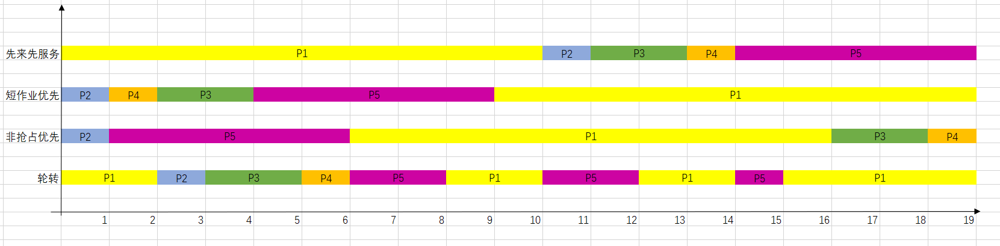

# 操作系统第五次理论作业

## 一.有五个进程P1、P2、P3、P4、P5，它们同时依次进入就绪队列，它们的优先数和需要的处理器时间如下表
|进程|处理器时间|优先级（数小优先级高）|
|:--:|:--:|:--:|
|P1| 10| 3|
|P2| 1| 1|
|P3| 2| 3|
|P4| 1| 4|
|P5| 5| 2|
## 忽略进行调度等所花费的时间，回答下列问题:
## a. 写出采用“先来先服务”、“短作业（进程）优先”、“非抢占式的优先数”和“轮转法”等调度算法，进程执行的次序。（其中轮转法的时间片为2）
## b. 分别计算上述算法中各进程的周转时间和等待时间，以及平均周转时间。

先来先服务：
|进程|周转时间|等待时间|
|:--:|:--:|:--:|
|P1|10|0|
|P2|11|10|
|P3|13|11|
|P4|14|13|
|P5|19|14|
平均周转时间：13.4

短作业优先：
|进程|周转时间|等待时间|
|:--:|:--:|:--:|
|P1|19|9|
|P2|1|0|
|P3|4|2|
|P4|2|1|
|P5|9|4|
平均周转时间：7

非抢占优先数：
|进程|周转时间|等待时间|
|:--:|:--:|:--:|
|P1|16|6|
|P2|1|0|
|P3|18|16|
|P4|19|18|
|P5|6|1|
平均周转时间：12

时间片轮转：
|进程|周转时间|等待时间|
|:--:|:--:|:--:|
|P1|19|9|
|P2|3|2|
|P3|5|3|
|P4|6|5|
|P5|15|10|
平均周转时间：9.6

## 二．死锁产生的四个必要条件是什么？

1. 互斥条件
2. 请求与保持条件
3. 不剥夺条件
4. 循环等待条件

## 三. 某系统中有n个进程和m台打印机，系统约定：打印机只能一台一台地申请、一台一台地释放，每个进程需要同时使用的打印机台数不超过m。如果n个进程同时需要使用打印机的总数小于m+n，试讨论，该系统可能发生死锁吗?并简述理由。

证明：
设第i个进程最大打印机需求量为Ri（1<=Ri<=m），考虑最坏情况，所有进程都已经得到了Ri-1个资源，都还差一个资源即可满足最大要求开始执行，此时若还剩下至少一个资源，则分配给任何一个进程皆可开始运行，则系统不会产生死锁。
∑(Ri—1)+ 1 = m
∑Ri – n + 1 = m
∑Ri = m + n – 1
∑Ri < m + n
满足题目要求，因此不会产生死锁。

## 四.线程的基本概念是什么？引入线程的好处是什么？

线程是操作系统能够进行运算调度的最小单位。它被包含在进程之中，是进程中的实际运作单位。一条线程指的是进程中一个单一顺序的控制流，一个进程中可以并发多个线程，每条线程并行执行不同的任务。

好处：
1. 创建一个新线程的代价比创建一个新进程要小的多；
2. 与进程相比，线程之间的切换需要操作系统做的工作要少很多；
3. 线程占用的资源要比进程少很多；
4. 能充分利用多处理器的可并行数量；
5. 在等待慢速I/O操作结束的同时，程序可执行其他的计算任务；
6. 计算密集型应用，为了能在多处理器系统上运行，将计算分解到多个线程中实现；
7. I/O密集型应用，为了能提高性能，将I/O操作重叠。线程可以同时等待不同的I/O操作。

## 五. 一个系统有4个进程和5个可分配资源，当前分配和最大需求如下：

|进程|已分配资源| 最大需求量 |可用资源|
|:--:|:--:|:--:|:--:|
|进程A| 10211| 11213| 00x12|
|进程B| 20110| 22210|
|进程C| 11010| 21310|
|进程D| 11110 |11221|
## 若保持该状态是安全状态，那么x的最小值是多少？

各进程需求矩阵
A 01002
B 02100
C 10300
D 00111

分类讨论：若x为0，则可用资源无法满足任何请求，发生死锁
若x为1，则可用资源可以满足D请求，D执行完后可用资源为11222，A可执行，A执行完后可用资源为10220+11213=21433，C可执行，C执行完后可用资源为11133+21310=32443，B可执行，皆可执行结束。x最小为1。