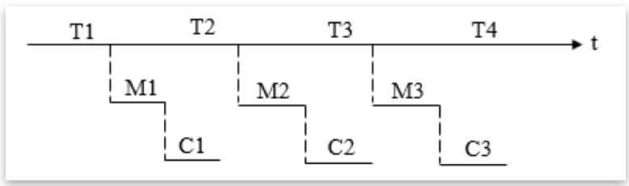
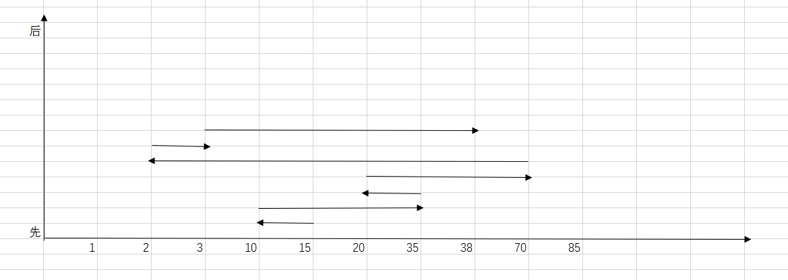
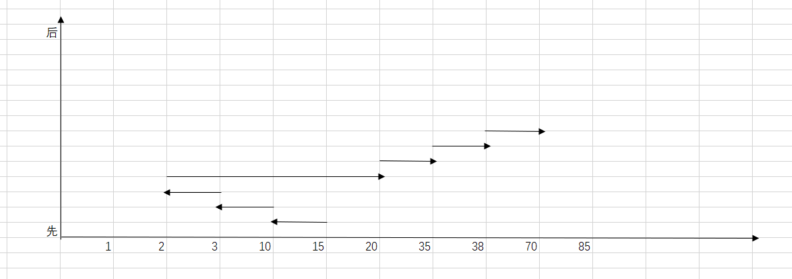
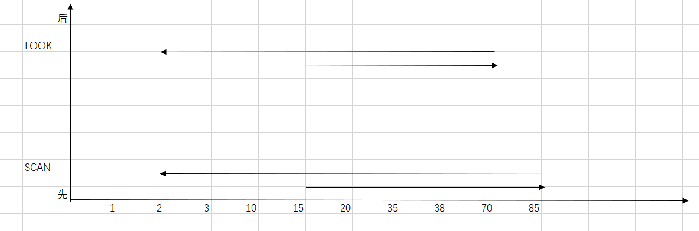
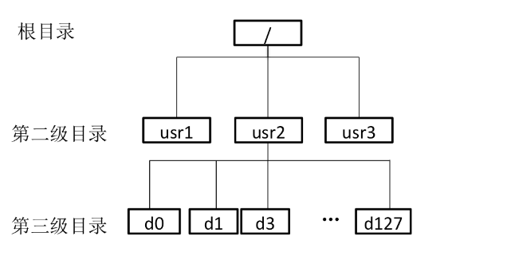

# 操作系统第六次理论作业

## 一. 文件系统的性能对整体系统的性能影响很大，请总结在实现文件系统时可以从哪些方面提高文件系统的性能，简要给出这些手段的具体解决思路。

目录项分解，当前目录，磁盘碎片整理，块高速缓存，磁盘调度，提前读取，合理分配磁盘空间，信息的优化分布，RAID技术等。

（1）目录管理：改进文件的目录结构以及检索目录的方法，来减少对文件的查找时间；
（2）文件存储方式，访问方式：选择性能更优异的文件存储结构，以提高对文件的访问速度；
（3）提高磁盘读写速度：通过采用磁盘高速缓存、优化物理块的分布、利用提前读、延迟写、优化物理块分布、并行交叉存取或虚拟盘等方法来提高磁盘I/O速度，以提高对数据的传送速度。 

## 二. 简述文件控制块（FCB）的主要内容。

虽然不同的系统,其文件控制块的内容和格式不完全相同,但通常都包括以下三类信息:基本信息、存取控制信息和使用信息。

(1)基本信息。包括文件名、文件号、用户名、文件类型、文件的物理地址、文件长度、文件的逻辑结构和物理结构等。其中用户名主要是指文件主和授权用户;而物理地址的内容通常与文件的物理结构有关,对于连续文件和链接文件,应说明起始盘块号,而对于索引文件,应给出其索引块号。

(2)存取控制信息。分别给出文件主、伙伴用户、一般用户的存取权限。

(3)使用信息。包括文件的建立日期及时间、上次存取文件的日期及时间、当前的使用信息等。

## 三. 在I/O系统中引入缓冲的主要原因是什么？某文件占10个磁盘块，现要把该文件的磁盘块逐个读入主存缓冲区，并送用户区进行分析。一个缓冲区与磁盘块大小相等。把一个磁盘块读入缓冲区的时间为100μs(1过程)，缓冲区数据传送到用户区的时间是50μs(2过程)，CPU对一块数据进行分析的时间为50μs(3过程)。分别计算在单缓冲区和双缓冲区结构下，分析完该文件的时间是多少？

引入缓冲的主要原因:(1)缓和CPU与I/O 设备间速度不匹配的矛盾;(2)减少对CPU的中断频率,放宽对中断响应时间的限制;(3)提高CPU与I/O 设备之间的并行性。

1过程不需CPU，23过程需CPU
单缓冲：
当磁盘块数据读入缓冲区的同时，CPU可以对一块数据进行处理，因此1，3过程可同步进行，由于1过程时间>3过程时间，每个磁盘块需要150微秒，共需要150*10 + 50 = 1550微秒。2过程不能和1过程同时进行，因为只有一片缓冲区，必须等CPU读取完缓冲区的内容再进行下一个磁盘块的读入。

双缓冲：
由于有两个缓冲区，则2过程也可和1过程同步进行，保证CPU和磁盘读写的不是一个缓冲区即可，因此处理每个磁盘块只需要100微秒，共需要100*10 + 100 = 1100微秒。

## 四. 分析磁盘访问数据的时间。假设磁盘请求以柱面10、35、20、70、2、3和38的次序进入磁盘驱动器。寻道时磁头每移动一个柱面需要6ms，以下各算法所需的寻道时间是多少：a) 先来先服务 b) 最短寻道时间优先 c) 扫描算法 说明：假设以上三种情况磁头初始位置为 15。
## 对于扫描算法，磁头当前向大柱面号方向运行，磁盘最大柱面号为 85，分别讨论 SCAN和 LOOK 算法的寻道时间。

先来先服务：

(5+25+15+50+68+1+35)*6 = 1194ms

最短寻道(若一样选择来得早的)：

(5+7+1+18+15+3+32)*6 = 486ms

扫描算法：

scan:(70+83)*6 = 918ms
look:(55+68)*6 = 738ms

## 五. 在文件系统中，访问一个文件 f 时首先需要从目录中找到与 f 对应的目录项。假设磁盘物理块的大小为 1KB，一个目录项的大小为 128 字节，文件的平均大小为100KB。该文件系统的目录结构如图所示。假定不考虑磁盘块的提前读和缓存等加速磁盘访问的技术。回答以下问题：
## 1） 按照当前的目录结构，且采用串联文件方式对数据块进行组织，并且根目录的目录项已读入内存中。如果目标文件f 在第三级目录下，且其对应的第三级目录的目录项可以一次从磁盘读出，访问文件f中的一个块平均需要访问几次磁盘？
## 2）如果采用 i 节点的方法来构建文件目录，假定文件名占 14 个字节，i 节点的指针占 2 个字节。如果仅采用直接索引，每个第三级目录下的文件数不超过 50 个，且根目录的 i 节点已读入内存，访问第三级目录下的一个文件的一个块平均需要访问几次磁盘？
## 3）假设该文件系统的空间最大容量为 16ZB(1ZB=2^70 B)。如果文件的 FCB 中包括512 字节的索引区，且允许采用一级索引进行组织，那么该文件系统支持的最大文件是多少字节？

1. 访问二级目录：根目录的目录项已经读入内存，那么读取二级目录不需要访问磁盘。

    访问三级目录：一个磁盘块1KB，每个目录项128B，那么一个磁盘块可以放1KB/128B=8个目录项；而如图所示每个二级目录下有128个三级目录，这些三级目录分布在128/8=16个磁盘块上。串联文件形式，访问一个三级目录项至少访问1次磁盘，至多访问16次磁盘，平均8.5次。

    访问三级目录内容：由于对应三级目录项可以一次从磁盘读出，故访问一次即可。
    访问文件块：文件平均大小100KB，每个磁盘块1KB，每个文件平均要分布在100KB/1KB=100个磁盘块上。串联文件形式，访问一个块至少访问1次磁盘，至多访问100次，平均50.5次。

    综上，平均共需要访问磁盘0+8.5+1+50.5=60次。

2. 由图中可知，第三级目录位于usr2下面。一个目录项占16个字节，因此一个磁盘块可以放2 ^ 10/2 ^ 4=2^6=64 个目录项。

    读取根目录的内容需读取1次磁盘：根目录inode已在内存中，根目录下只有3个目录项，可以1次读取。

    读取usr2的inode需读取1次磁盘：从对应usr2的目录项中可获得usr2的inode号，进而通过读取磁盘可获得usr2的inode。

    读取usr2目录的内容（即对应d0-d127的目录项）需读取1.5次磁盘：读取整个第三级目录所对应的目录项需要访问磁盘128/64=2次，因此平均需要读取(1+2)/2=1.5次。

    读取第三级目录的inode需读取1次磁盘。

    读取第三级目录的内容需读取1次磁盘：由于第三级目录下的文件不超过50个，因此读取1次磁盘即可将对应全部文件的目录项读出。

    读取文件的inode需要读取1次磁盘。

    读取文件的1个块需要读取1次磁盘：由于采用直接索引，故根据inode可直接读取磁盘上文件的一个块。

    ​ 综上，访问第三级目录下一个文件的一个块平均需要 1+1+1.5+1+1+1+1=7.5 次磁盘。

3. 文件系统最多允许记录的磁盘块数为16ZB/1KB=2^64个磁盘块。为表示这些磁盘块，需要64位，即8字节空间。inode中的索引区可以存放 512B/8B=64个磁盘块，一级索引指向的磁盘块中可存储1KB/8B=128个磁盘块号，在采用一级索引的情况下，支持的最大文件为64\*128\*1KB=8MB。