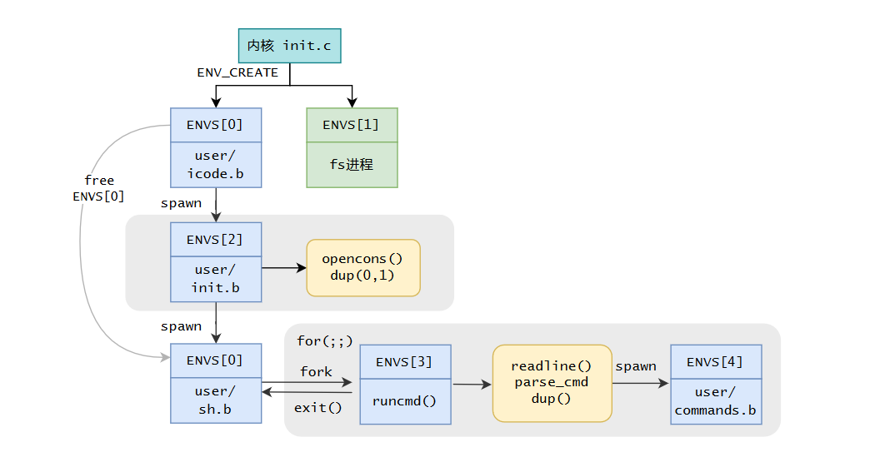
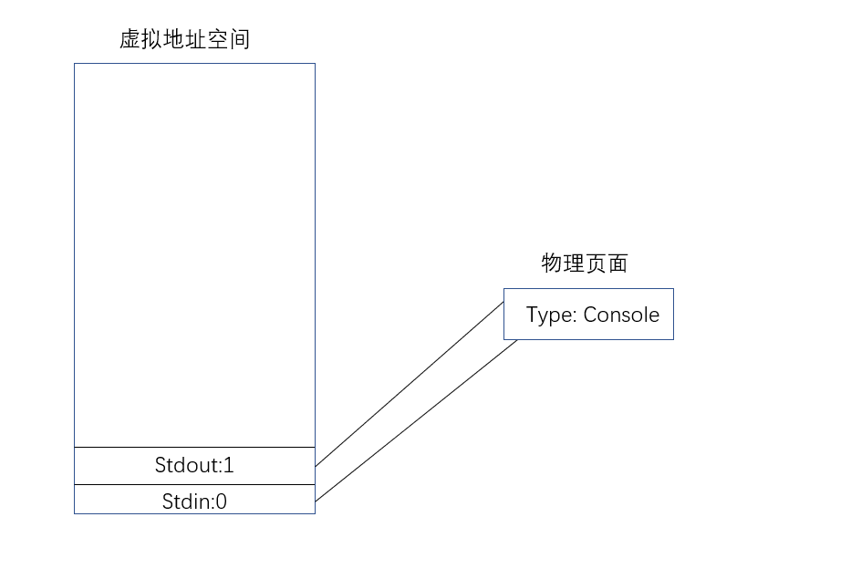
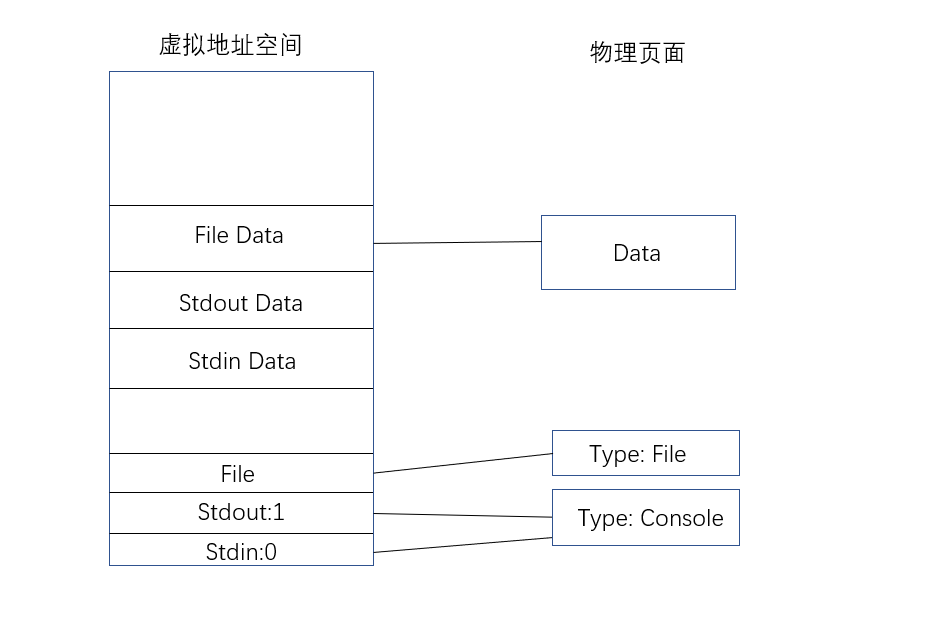
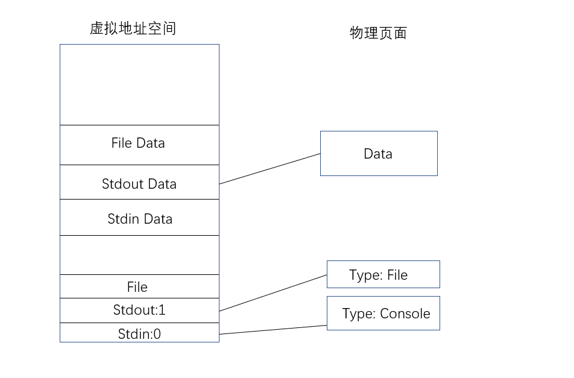
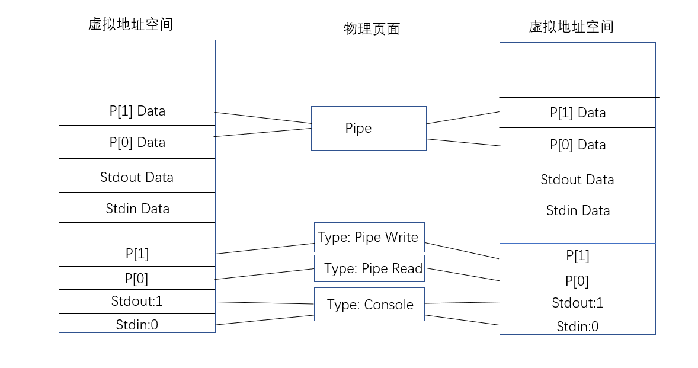

# 操作系统LAB6实验报告

## 一.思考题
### 1. 示例代码中，父进程操作管道的写端，子进程操作管道的读端。如果现在想让父进程作为“读者”，代码应当如何修改？

    case 0: /* 子进程 - 作为管道的写者 */
    close(fildes[0]); /* 关闭不用的读端 */
    write(fildes[1], "Hello world\n", 12); /* 向管道中写数据 */
    close(fildes[1]); /* 写入结束，关闭写端 */
    exit(EXIT_SUCCESS);

    default: /* 父进程 - 作为管道的读者 */
    close(fildes[1]); /* 关闭不用的写端 */
    read(fildes[0], buf, 100); /* 从管道中读数据 */
    printf("child-process read:%s",buf); /* 打印读到的数据 */
    close(fildes[0]); /* 读取结束，关闭读端 */
    exit(EXIT_SUCCESS);

颠倒一下父子进程操作即可。

### 2. 上面这种不同步修改 pp_ref 而导致的进程竞争问题在 user/lib/fd.c 中的 dup 函数中也存在。请结合代码模仿上述情景，分析一下我们的 dup 函数中为什么会出现预想之外的情况？

dup函数的用途是复制文件，包括复制文件控制块和文件内容两个步骤，即会令原文件控制块和文件次数的物理页面引用次数加一，算是指导书提到的close的逆操作，自然顺序值得考究。原代码中，先完成控制块的映射再完成内容的映射。

考虑如下代码：
    // 子进程
    close(p[1]);
    read(p[0], buf, sizeof(buf));
    close(p[0]);

    // 父进程    
    dup(p[0], newfd);
    close(p[0]);
    write(p[1], "Hello", 5);
    close(p[1]);

fork结束后，父进程先运行，在 dup 中，已经完成了p[0]的映射，还没完成pipe的映射，这时发生了中断。

切换到子进程运行，进入 read 函数时，发现 ref(p[0]) == ref(pipe) == 3(p[0]由于dup了一次且父进程还没close(p[0])，因此是3；而pipe由于子进程close(p[1])减1，因此也是3)，满足退出条件，子进程退出，造成错误。

### 3.阅读上述材料并思考：为什么系统调用一定是原子操作呢？如果你觉得不是所有的系统调用都是原子操作，请给出反例。希望能结合相关代码进行分析说明。

原子操作即在内核状态完成，操作时不会被时钟中断打断而切换进程的操作，所有系统调用都是原子操作，因为在进入内核时便关闭了全局中断，这部分是由CPU硬件完成的，可参见计组P7。系统调用是原子操作一方面是为了不可打断性，另一方面是为了保护操作系统，避免最底层的函数暴露在用户态下。

### 4.仔细阅读上面这段话，并思考下列问题
* ## 按照上述说法控制 pipe_close 中 fd 和 pipe unmap 的顺序，是否可以解决上述场景的进程竞争问题？给出你的分析过程。##
* ## 我们只分析了 close 时的情形，在 fd.c 中有一个 dup 函数，用于复制文件描述符。试想，如果要复制的文件描述符指向一个管道，那么是否会出现与 close 类似的问题？请模仿上述材料写写你的理解。## 

* 可以解决，由于在不该退出的条件下 ref(pipe)恒大于ref(fd)，因此先解除fd的映射令ref(fd)--，再解除pipe的映射令ref(pipe)--，**小者更小**，仍然满足 ref(pipe) > ref(fd)。

* dup 应使用同样的解决方法，先复制文件内容令ref(pipe)++，再复制文件控制块令ref(fd)++，**大者更大**，仍然满足 ref(pipe) > ref(fd)，如此便不会造成错判。

### 5.思考以下三个问题。
* ## 认真回看 Lab5 文件系统相关代码，弄清打开文件的过程。 ##
* ## 回顾 Lab1 与 Lab3，思考如何读取并加载 ELF 文件。 ##
* ## 在 Lab1 中我们介绍了 data text bss 段及它们的含义，data 段存放初始化过的全局变量，bss 段存放未初始化的全局变量。关于 memsize 和 filesize ，我们在 Note 1.3.4中也解释了它们的含义与特点。关于 Note 1.3.4，注意其中关于“bss 段并不在文件中占数据”表述的含义。回顾 Lab3 并思考：elf_load_seg() 和 load_icode_mapper()函数是如何确保加载ELF文件时，bss 段数据被正确加载进虚拟内存空间。bss 段在 ELF 中并不占空间，但 ELF 加载进内存后，bss 段的数据占据了空间，并且初始值都是 0。请回顾 elf_load_seg() 和 load_icode_mapper() 的实现，思考这一点是如何实现的？ ##

1. 打开文件的流程：
   (1)用户进程申请文件描述符，发送请求(文件的路径以及打开模式) 

   (2)文件服务系统收到open请求，申请Open符表，在磁盘中根据路径寻找文件，将对应磁盘块读取到块缓存中，填充好Filefd发回

   (3)用户进程根据文件内容大小，使用 fsipc_map 在 fd 对应的 data 地址映射文件服务进程的文件内容，自此在用户进程地址空间有了该文件的基本信息与内容。

2.  Lab3 中我们创建进程，并且通过 ENV_CREATE(...) 在内核态加载了初始进程，而我们的 spawn 函数则是通过和文件系统交互，取得文件描述块，进而找
到 ELF 在“硬盘”中的位置，进而读取。针对spawn的读取流程如下：

    (1)根据文件路径读取文件进父进程地址空间。

    (2)读文件头找到段表首地址等信息。

    (3)根据段表首地址与段表项大小遍历所有段表项，每个段表项包含段起始地址(在文件中的偏移)，加载到的地址以及段大小信息，使用 elf_load_seg 将需要加载的段的内容加载进子进程地址空间。

3. 我们可以通过段表读取到filesz和memsz，因此若memsz > filesz，则在最后补上相应的0即可。

        lib/elfloader.c:
        while (i < sgsize) {
            if ((r = map_page(data, va + i, 0, perm, NULL, MIN(bin_size - i, BY2PG))) != 0) {
                return r;
            }
            i += BY2PG;
        }

### 6.通过阅读代码空白段的注释我们知道，将标准输入或输出定向到文件，需要我们将其 dup 到 0 或 1 号文件描述符（fd）。那么问题来了：在哪步，0 和 1 被“安排”为标准输入和标准输出？请分析代码执行流程，给出答案。 

在 user/init.c 中，使用opencons + dup(0, 1)将0号和1号文件安排为标准输入和输出。

    user/init.c:
    if ((r = opencons()) != 0) {
        user_panic("opencons: %d", r);
    }
    // stdout
    if ((r = dup(0, 1)) < 0) {
        user_panic("dup: %d", r);
    }

    user/lib/console.c:
    int opencons(void) {
        int r;
        struct Fd *fd;
        if ((r = fd_alloc(&fd)) < 0) { //由于一开始无其他文件，所以一定申请到0号文件
            return r;
        }
        if ((r = syscall_mem_alloc(0, fd, PTE_D | PTE_LIBRARY)) < 0) {
            return r;
        }
        fd->fd_dev_id = devcons.dev_id;
        fd->fd_omode = O_RDWR;
        return fd2num(fd);
    }

### 7.在 shell 中执行的命令分为内置命令和外部命令。在执行内置命令时 shell 不需要 fork 一个子 shell，如 Linux 系统中的 cd 命令。在执行外部命令时 shell 需要 fork一个子 shell，然后子 shell 去执行这条命令。据此判断，在 MOS 中我们用到的 shell 命令是内置命令还是外部命令？请思考为什么Linux 的 cd 命令是内部命令而不是外部命令？

都是外部命令，因为每读入一条命令便fork出来一个子shell。

linux中的内部命令实际上是shell程序的一部分，其中包含的是一些比较简单的linux系统命令，这些命令由shell程序识别并在shell程序内部完成运行，通常在linux系统加载运行时shell就被加载并驻留在系统内存中。因为cd指令非常简单，将其作为内部命令写在bash源码里面的，可以避免每次执行都需要fork并加载程序，提高执行效率。

### 8.在你的 shell 中输入命令 ls.b | cat.b > motd。
* ## 请问你可以在你的 shell 中观察到几次 spawn ？分别对应哪个进程？##
* ## 请问你可以在你的 shell 中观察到几次进程销毁？分别对应哪个进程？##

1. 两次spawn，分别对应执行ls.b和cat.b的进程。
2. 四次进程销毁，分别是spawn出来的ls.b和cat.b被销毁，以及它们的父进程(调用spawn的进程)被销毁。

## 二.实验难点

本次实验难点主要在于对管道和重定向机制的理解，更具体来说在于虚拟与物理的对应关系。

### 1.Shell机制

借用指导书的图，有几个关键点。
1. 在init.c中将0，1文件设置为输入输出。然而通过阅读代码我们可以发现，该控制台文件并没有“内容”，输入输出以读写01号文件实现，然而console的read，write函数也是直接系统调用控制台输入输出，相当于中间加了一层过渡，看似没有意义，但却为重定向和管道打下铺垫。

2. 在系统启动时spawn出来一个shell，后每执行一条命令fork一个子进程，在子进程中再spawn出来子进程填充对应的命令代码执行，一条命令执行完后，两个子进程随之消亡。

### 2.重定向机制

实现shell中重定向输出的机制如图：

与下文shell管道的原理相同，核心都是**改变了输入输出文件的类型导致改变了read，write函数**。以本图为例，改变输出文件类型为File，当输出内容时，由于stdout变为了File文件，则会调用File类型文件的write函数，将内容写入文件中。

### 3.管道机制

实现shell中管道机制如图：

它改变了输入输出文件的类型为Pipe，当输入输出内容时，会调用实现过的Pipe read/write，完成了管道内容的读写，效果好似将两个进程**串联**了起来。

## 三.心得体会

行文至此，也便意味着OS实验课也即将彻底落下帷幕。本LAB一共用时20h左右，填写代码难度较为简单，但理解代码十分不易，且在管道读写的机制上出现了一些问题耽误了笔者很长时间。我们实现了管道机制并制作了简单的Shell，其中重定向的实现机制令笔者称奇，当shell界面出现在眼前时，一学期的一切努力都转化成了满满的成就感。然而目前实现的功能仅有ls，cat，echo等简单命令，笔者正在进行LAB6挑战性任务的实验，完成一个加强shell实现更多的命令，想必会更加有趣(且苦难。