# 操作系统LAB6挑战性任务实验报告

## 一.实现需求 
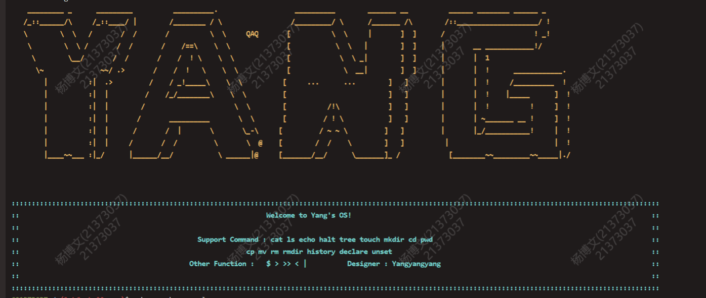

指导书要求实现的功能：
    **一行多命令 ；**
    **后台任务 &**
    **引号支持 “”**
    **光标交互的完善(上下左右以及BACKSPACE各自的功能实现以及协作交互)**
    **程序名称.b的省略**
    **记录历史命令**
    **更丰富的命令 ：tree; mkdir [-p]; touch [-p]; history** 
    **选做一：实现shell环境变量，支持declare [-xr], unset, $**
    **选做二：支持相对路径, 支持内部命令cd, pwd**

自己额外实现的功能：
    **追加重定向 >>**
    **转义符 \\**
    **支持上级目录 .. , 当前目录 .**
    **更丰富的命令：cp [-r]; mv; rm [-rf]; rmdir [-p]**

上述所有功能皆以 Linux 的行为作为参照，某些地方存在差异。

## 二.实现思路

### 1.一行多命令

核心代码如下，同管道机制，令父进程执行右面，子进程执行左面，父进程等待子进程结束后再开始执行。

        sh.c:
        case ';': //依次执行左右两边的指令
            if ((r = fork()) < 0) {
                debugf("fork error!\n");
                exit();
            }
            if (r > 0) { //父进程
                wait(r); //等待子进程结束
                return parsecmd(argv, rightpipe);
            } else {
                return argc;
            }

测试如下：

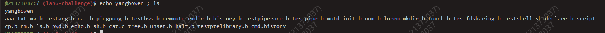

### 2.后台命令

基本同一行多命令，只不过父进程不再等待子进程结束，而是同步执行。由于在父进程执行完命令后shell便会开始读取新一行的指令，而控制台读取字符的方式是忙等，即CPU轮询，因此会出现父进程执行完后子进程还未执行完，直到输入下一条命令后子进程的输出才会显示出来的现象。

		case '&':
			if ((r = fork()) < 0) {
				debugf(" & fork error!!\n");
				exit();
			}
			if (r > 0) { //父进程执行右面，当右面执行完毕，即可开始下一次轮询获取指令 
				return parsecmd(argv, rightpipe);
			} else { //子进程执行左面
				return argc;
			}
			break;

测试如下：

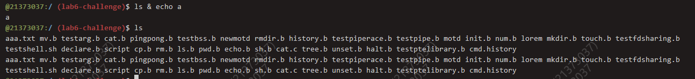

### 3.引号支持

支持引号，支持转义 \ 和 " ，由于转义会忽略 \ ，使用原先的输入序列进行字符串切割分割为许多子串的方法会出现问题，因此开了二维字符串数组来存储处理过的token。

    char w[128][128];
    int wcnt;

    _gettoken:
	wcnt++;
	while (*s && !strchr(WHITESPACE SYMBOLS, *s)) { //读过整个单词
		while (strchr("\"", *s)) {
			s++;
			while(*s && !strchr("\"", *s)) {
				if (strchr("\\", *s) && strchr("\"\\", *(s + 1))) { // \\ \" 
					s++;
				}
				w[wcnt][c++] = *s;
				s++;
			}
			s++;
		}
		if (strchr("\\", *s) && strchr("\"\\", *(s + 1))) {
			s++;
		}
		//debugf(" %c ", *s);
		w[wcnt][c++] = *s;
		s++;
	}
	*p2 = s;
	w[wcnt][c] = 0; //封0
	*p1 = w[wcnt];
	return 'w';

基本功能与linux保持一致，测试如下：

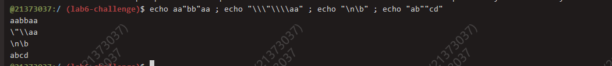

### 4.光标交互

**这一部分是本实验第一大难点。** 课程组给好的shell无法删除，也只能在光标处进行修改字符，而且修改后也无法正常运行，这是由于**输入逻辑与内部逻辑不匹配**导致的，为方便后续功能的实现与测试，做好用户交互是重要的，因此笔者完全按照Linux的逻辑修改了光标交互，具体来说，按BACKSPACE可以删除光标后的字符，按LEFT和RIGHT可以调整光标的位置，输入字符时会**增加**而非**替换**，按UP和DOWN可以翻滚历史命令，并同样支持修改，总的来说与跳板机Linux无异。

首先，控制台有几个基本逻辑，这些逻辑不体现在代码上，应当是外设的逻辑：
1. 输出一个字符就在光标处的原本字符替换为该字符 且光标前移一个，控制符包括\0不会改变光标位置
2. right left只会让光标左移右移，backspace对光标无影响
3. 上键光标会往上一格 而下键不会往下一格
   
用到的ASCII码：
上下左右键由三个ASCII码组成：
up 27 91 65，
down 27 91 66，
left 27  91  68，
right 27  91  67。
backspace 127。

刚刚提到逻辑不匹配的问题，因此我们除了维护**输入序列**外还需维护一个**真正待执行的指令字符串序列**，并维护字符串长度 max 以及当前光标的位置 pointer。在显示上，使用输出空格和\b退格的方式调整光标的位置和可视化指令序列，其重点在于既要修改外部显示又要修改内部指令序列，确保**眼见必定为实**。

核心代码如下，经过后续大量测试正确性得以保证：

    void readline(char *buf, char *buf1, u_int n) {
        int r;
        memset(buf, 0, 1024);
        memset(buf1, 0, 1024);
        int pointer = 0; //指向光标所在位置
        int max = 0;
        int history = open("cmd.history", O_RDWR);
        int hispointer = get_file_size(history); //记录file的屁股
        int i, j, k;
        for (i = 0; i < n; i++) {
            if ((r = read(0, buf + i, 1)) != 1) { //从标准读入中读取数据
                if (r < 0) {
                    debugf("read error: %d\n", r);
                }
                exit();
            }
            if (buf[i] == '\b' || buf[i] == 0x7f) { //三种特殊情况
                //buf1[pointer] = ' ';
                if (pointer != 0) { //删除 max--
                    char tmp[128];
                    strcpy(tmp, buf1 + pointer); //从pointer到最后暂存起来
                    if (buf[i] != '\b') { //输出一个回退字符 回退光标同步
                        debugf("\b"); //到后面一格
                    }
                    for (j = 0; j < max - pointer; j++) {
                        debugf("%c", tmp[j]);
                    }
                    printf(" ");
                    for (j = 0; j < max - pointer + 1; j++) {
                        debugf("\b");
                    } //多回退一个
                    pointer--;
                    for (j = 0, k = pointer; tmp[j] != 0; j++, k++) {
                        buf1[k] = tmp[j]; //修改buf1中内容
                    }
                    buf1[k] = 0;
                    max--;
                }
                continue;
            }
            if (buf[i] == 27) {
                i++;
                r = read(0, buf+i, 1);
                i++;
                r = read(0, buf+i, 1);
                if (buf[i] == 68) {
                    if (pointer != 0) {
                        pointer--;
                    } else {
                        debugf(" ");
                    }
                } else if (buf[i] == 67) {
                    if (pointer < max) {
                        pointer++;
                    } else {
                        debugf("\b");
                    }
                } else if (buf[i] == 65) { //up
                    //debugf("\n21373037:(%s)$ ", env->env_workingpath); //往上滚了 所以要换行一下到原来的位置
                    debugf("%c%c%c", 27, 91, 66); //下移
                    for (j = 0; j < pointer; j++) {
                        debugf("\b"); //没刷掉
                    } 
                    for (j = 0; j < max; j++) {
                        debugf(" ");
                    }
                    for (j = 0; j < max; j++) {
                        debugf("\b");
                    }
                    uphistory(buf1, &hispointer);
                    pointer = strlen(buf1);
                    max = pointer;
                    //debugf("poi : %d\n ", pointer);
                    continue;
                } else if (buf[i] == 66) {
                    //debugf("%c%c%c", 27, 91, 65); //上移
                    //debugf("\n21373037:(%s)$ ", env->env_workingpath);
                    for (j = 0; j < pointer; j++) {
                        debugf("\b");
                    }
                    for (j = 0; j < max; j++) {
                        debugf(" ");
                    }
                    for (j = 0; j < max; j++) {
                        debugf("\b");
                    }
                    downhistory(buf1, &hispointer);
                    pointer = strlen(buf1);
                    max = pointer;
                    //debugf("poi : %d\n", pointer);
                    continue;
                }
                continue;
            } 
                
            if (buf[i] == '\r' || buf[i] == '\n') {
                buf[i] = 0;
                return;
            }
            char tmp[128];
            strcpy(tmp, buf1 + pointer); //暂存指针之后所有内容
            //printf("%c", buf[i]); //正常情况
            buf1[pointer] = buf[i];
            pointer++;
            for (j = 0, k = pointer; j < strlen(tmp); j++, k++) {
                debugf("%c", tmp[j]);
                buf1[k] = tmp[j];
            }
            for (j = 0; j < strlen(tmp); j++) {
                debugf("\b");
            }
            max++; //记录最大长度
        }
    }

本功能用图不好展示，可以实际展示，使用时**与Linux一模一样**。

### 5.程序名称.b的省略

最简单的一项，判断argv[0]（指令名称）结尾是否为.b，若不是，加上后缀即可。需要注意的是，若仍使用在原本字符串上切割的方式得到argv[i]的方法(即自带的方法)，则往后追加.b会占用到别的argv的空间，造成严重的错误，将argv[0]拷贝一份再追加是正确的选择。

### 6.记录历史命令

在shell执行开始时创建cmd.history文件，在每次读入命令后将该行命令追加到文件尾，以\n作为分隔符，追加写入即使用文件控制块得到文件大小再使用seek函数找到文件尾写入即可，追加重定向 >> 也是同样思路。

上下键的翻滚，需要动态维护一颗指针(永远指向\n的后一个字符)，初始时指向文件尾，向上翻滚则找到上一个\n，并读取两个\n中间的内容，向下翻滚则找到下一个\n，并读取再向下一行的内容。重点在于上下的临界情况要考虑清楚，若到达上下界再翻滚应当无事发生。

    void uphistory(char *buf1, int *hispointer) {
        memset(buf1, 0, 1024);
        if (*hispointer == 0) {
            //debugf("no up!");
            return;
        }
        int history = open("cmd.history", O_RDWR); //从0开始
        char file[*hispointer];
        int last = 0, i;
        int n = read(history, file, *hispointer); //file找临近末尾的\n
        //debugf(" %d ", file[*hispointer - 1]); 换行
        for (int i = *hispointer - 2; i >= 0; i--) {
            if (file[i] == '\n') {
                last = i + 1;
                break;
            } else if (i == 0) {
                last = 0;
                break;
            }
        }
        //从Last 到 hispointer
        for (i = last; i < *hispointer - 1; i++) {
            debugf("%c", file[i]);
            buf1[i - last] = file[i];
        }
        buf1[i - last] = '\0'; //把\n读走
        *hispointer = last;
        close(history);
        return;
    }

    void downhistory(char *buf1, int *hispointer) {
        memset(buf1, 0, 1024);
        int history = open("cmd.history", O_RDWR);
        seek(history, *hispointer);
        int r;
        int i, tmp;
        for (i = 0; i < 1024; i++) {
            r = read(history, buf1 + i, 1);
            //debugf(" %d ", buf1[i]);
            if (buf1[i] == 0) { //适用于一开始便在文件末尾处
                //debugf("no down!");
                if (i != 0) {
                    debugf("down wrong!");
                }
                return;
            }
            if (buf1[i] == '\n') {
                //debugf(" nextline ");
                tmp = *hispointer + i + 1; //给pointer赋上值
                break;
            }
        }
        memset(buf1, 0, 1024); //要回显的是再下一条
        for (i = 0; i < 1024; i++) {
            r = read(history, buf1 + i, 1);
            if (buf1[i] == 0) {
                //debugf("no down!");
                if (i != 0) {
                    debugf("doen wrong!\n");
                }
                return;
            }
            if (buf1[i] == '\n') {
                *hispointer = tmp;
                break;
            }
            debugf("%c", buf1[i]);
        }
        buf1[i] = 0;
        close(history);
        return;
    }

展示如下：
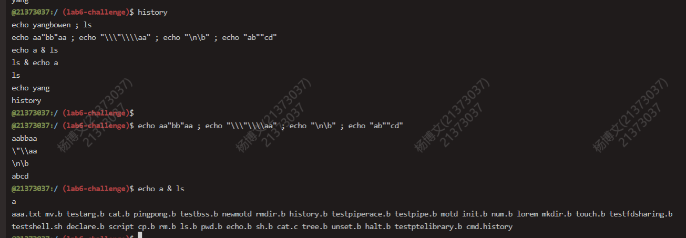

### 7.更丰富的命令

与文件系统交互的指令大致分为两种，一种是只读文件结构，在用户进程便可处理，比如ls，tree；另一种需要对文件结构进行写入，笔者通过已经写到麻木的与文件服务进程交互的方式，通过文件服务进程对其修改。

#### tree
tree是输出文件系统树状结构，不涉及改变文件结构，仿照ls递归输出即可，笔者特别对目录和文件在输出时做出了区分。

    int deepth = 0;
    void tree(char *path, char *name) {
        int r;
        int fd, n;
        struct File f;
        struct Stat st;
        if ((r = stat(path, &st)) < 0) {
            user_panic("stat fail!\n");
        }
        if ((fd = open(path, O_RDONLY)) < 0) {
            user_panic("open fail!\n");
        }
        if (!st.st_isdir) {
            printf("|");
            for (int i = 0; i < deepth; i++) {
                printf("----");
            }
            printf("%s\n", name);
            deepth--;
            close(fd);
            return;
        }
        while ((n = readn(fd, &f, sizeof f)) == sizeof f) {
            if (f.f_name[0]) { //寻找dir的下层 只有是目录时要输出名字 文件时在上面输出
                deepth++;
                if (f.f_type == FTYPE_DIR) {
                    printf("|");
                    for (int i = 0; i < deepth; i++) {
                        printf("----");
                    }
                    printf("*%s\n", f.f_name);
                }
                int len = strlen(f.f_name) + strlen(path) + 1;
                char newpath[len + 1];
                strcpy(newpath, path);
                strcpy(newpath + strlen(path), "/");
                strcpy(newpath + strlen(path) + 1, f.f_name);
                newpath[len+1] = 0;
                tree(newpath, f.f_name);
            }
        }
        deepth--;
        close(fd);
        return;
    }	

#### mkdir
mkdir是增加文件结构的指令，根据能不能创建多级目录(一口气创建两个及以上)用-p符号作出了区分，同时考虑到了Linux中诸如mkdir -p a/../b 会创建a和b两个目录的情况，即**路径并非提前处理好而是边创建边解析**，代码按照 walk_path 仿写，**利用了文件控制块中未使用过的 f_dir 记录父节点**，极大简化了实现。
在此展示fs/fs.c的核心代码：

    int mkdir(char *path, int op) {
        char *p;
        char name[MAXNAMELEN];
        struct File *dir, *file;  //解决 /a/../b
        int r;
        path = skip_slash(path);
        file = &super->s_root;
        //addFileName(file, "/");
        dir = 0;
        name[0] = 0;
        while (*path!= '\0') {
            dir = file;
            p = path;

            while(*path != '/' && *path != '\0') {
                path++;
            }
            if (path - p >= MAXNAMELEN) {
                return -E_BAD_PATH;
            }
            memcpy(name, p, path - p); //path在后 p在前
            name[path - p] = '\0';
            path = skip_slash(path);
            while (strcmp(name, "..") == 0) { //处理.. 
                dir = dir->f_dir;  //指向他的父亲dir
                p = path;
                while(*path != '/' && *path != '\0') {
                    path++;
                }
                if (path - p >= MAXNAMELEN) {
                    return -E_BAD_PATH;
                }
                memcpy(name, p, path - p);
                name[path - p] = '\0';
                path = skip_slash(path);
            }
            if (dir->f_type != FTYPE_DIR) {
                return -E_NOT_FOUND;
            }
            r = dir_lookup(dir, name, &file);
            if (r == 0 && *path == 0 && file->f_type == FTYPE_REG) {
                debugf("target is a reg file!\n");
                return -E_NOT_FOUND;
            }
            if (r == 0 && *path == 0) {
                debugf("dir already exist!\n");
            }
            if (r < 0) { //该创建了 还需要判断最后一层若存在是否为reg
                if (r == -E_NOT_FOUND) {
                    if (*path == 0 || op == 1) {
                        if (dir_alloc_file(dir, &file) < 0) {
                            return r;
                        }
                        strcpy(file->f_name, name);
                        //file->f_dir = dir;
                        file->f_type = FTYPE_DIR;
                    } else {
                        debugf("can't find dir : %s!\n", name);
                        return r;
                    }
                } else {
                    return -1;
                }
            }
        }
        return 0;
    }

可以看到，mkdir若不使用-p命令则最多只能创建一个目录，多于一个目录会报错；而使用-p命令可以创建多级目录

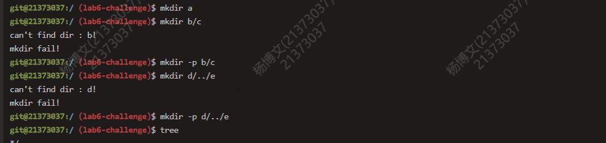
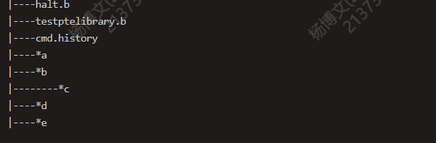

#### touch

touch是用来更新文件日期的指令(文件日期感觉也可以实现，奈何时间有限)，也可以用来创建文件。touch整体思路同mkdir，linux中并没有创建多级目录后再创建文件的 -p 选项，然而我们的YangOS总要有其与众不同之处，因此也支持了类似 mkdir 的 -p 选项。

    int touch(char *path, int op) {
        char *p;
        char name[MAXNAMELEN];
        struct File *dir, *file;
        int r;
        path = skip_slash(path);
        file = &super->s_root;
        dir = 0;
        name[0] = 0;
        while(*path != '\0') {
            dir = file;
            p = path;
            while (*path != '/' && *path != '\0') {
                path++;
            }
            if (path - p >= MAXNAMELEN) {
                return -E_BAD_PATH;
            }
            memcpy(name, p, path - p);
            name[path - p] = '\0';
            path = skip_slash(path);
            if (dir->f_type != FTYPE_DIR) {
                return -E_NOT_FOUND;
            }
            r = dir_lookup(dir, name, &file);
            if (r == 0 && *path == 0 && file->f_type != FTYPE_REG) { //找到且最后一级 准确来说是路径有误
                debugf("path wrong can't touch!\n");
                return -E_NOT_FOUND;
            }
            if (r < 0) {
                if (r == -E_NOT_FOUND) {
                    if (*path == 0 || op == 1) {
                        if (dir_alloc_file(dir, &file) < 0) {
                            return r;
                        }
                        strcpy(file->f_name, name);
                        if (*path != 0) {
                            file->f_type = FTYPE_DIR;
                        } else {
                            file->f_type = FTYPE_REG;
                        }
                    } else {
                        debugf("can't find dir : %s!\n", name);
                        return r;
                    }
                }
            }
        }
        return 0;
    }

课程组在头文件中给出了CREAT，MKDIR等文件打开方式，但笔者认为创建与打开无关，所以并未使用，不过大体思路无异，通过 ipc 与文件服务进程通信达到创建文件的目的。

演示如下：

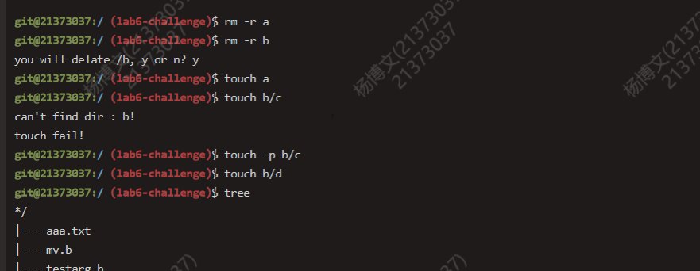
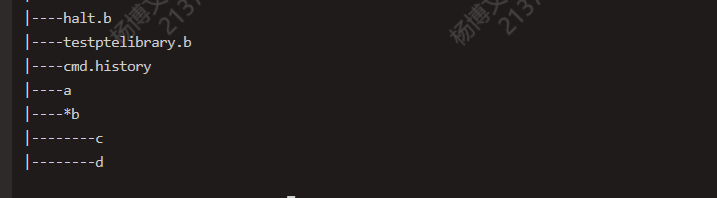

### 8.支持相对路径

在进程控制块中维护当前工作目录，初始化为 \ ，并在创建子进程时令子进程继承该值。

    env.h:
	char env_workingpath[1024];
	u_int env_shid;

实现系统调用 syscall_changing_workingpath，顾名思义改变工作目录。

提前声明：除了mkdir a/../b 这个特殊情况，其他所有涉及路径的指令均采用提前处理的方式，即 a/../b 会当成 b 处理。

由于实现了支持上级目录 .. 和 当前目录 . ，则路径转换需要分两步走，第一步将工作目录和输入的路径拼接，需要考虑拼接处和结尾处 / 的问题；第二步处理拼接后的序列中存在的 .. 以及 . 的情况，最后得到真正可被文件系统识别的路径，cd指令如此，其余涉及路径转化的指令亦是如此。

    char truepath[1024];
    char* path_switch(char *path) {
        if (path[0] == '/') {
            return path;
        } else {
            memset(truepath, 0, sizeof truepath);
            strcpy(truepath, env->env_workingpath);
            
            if (truepath[strlen(truepath) - 1] != '/') {
                truepath[strlen(truepath)] = '/';
            }
            strcpy(truepath + strlen(truepath), path);
            return truepath;
        }
    }

    char finalpath[1024];
    char* parsepath(char *path) { //path是组装好的路径
        int p1 = 0;
        for (int i = 0; i < strlen(path); i++) {
            if (path[i-1] == '/' && path[i] == '.' && ((path[i+1] == '.' && (path[i+2] == '/' || path[i+2] == 0)) || (path[i+1] == '/' || path[i+1] == 0))) {
                if (path[i+1] == '.') {
                    p1 = p1 - 2;
                    if (p1 < 0) {
                        debugf("root is first level!\n");
                        return -1;
                    }
                    for (; p1 >= 0; p1--) {
                        //debugf("p1 : %d\n", p1);
                        if (finalpath[p1] == '/') {
                            break;
                        }
                    }
                    if (path[i+2] == '/') {
                        i = i + 2;
                        p1++;
                        continue; // /a/../c
                    } else if (path[i+2] == 0) {
                        break;
                    }
                } else if (path[i+1] == 0){
                    p1--;
                    break;
                } else if (path[i+1] == '/') {
                    i++; // /a/./c p1指向.
                    continue;
                }
            } else {
                finalpath[p1] = path[i];
                    p1++;
            }
        }
        if (p1 != 0) {
            finalpath[p1] = 0;
        } else {
            finalpath[1] = 0;
        }
        return finalpath;
    }

cd 指令并不复杂，因此是一个内部指令，即不需要spawn出子进程专门处理，而是在原shell中执行。pwd 也是如此，直接输出进程控制块中工作目录的内容即可。

    int chdir(char *path) {
        path = parsepath(path_switch(path));
        struct Stat st;
        int r;
        if ((r = stat(path, &st)) < 0) {
                debugf("cd path wrong!\n");
                return r;
        }
        if (st.st_isdir == 0) {
                debugf("cd path is reg file!\n");
                return -E_NOT_FILE;
        }
        syscall_change_workingpath(0, path);
        return 0;
    }

对于在用户态获取到的内核态的信息，可读，但不可写(应当是硬件约束)，若想写则必须通过系统调用，同时 printf 不允许访问内核地址，两种解决办法，第一种将其在用户态复制一份，第二种把printf的地址检查注释掉(笑。

测试如下:
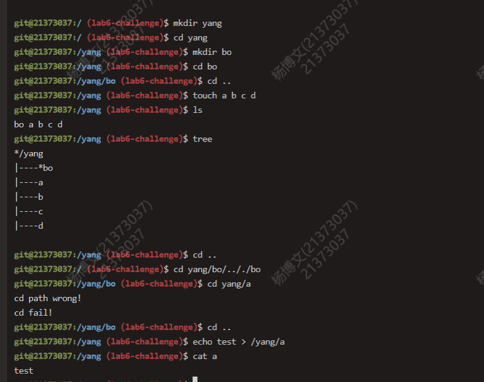

### 9.支持环境变量

declare 可声明的变量包括局部变量(对当前shell可见)以及环境变量(对子shell可见)，对于环境变量笔者实现的是全局可见，应当是有所瑕疵。

为区分局部变量和环境变量，在进程控制块中新增了shid，来区分不同的shell，每当创建新shell时为其赋予不同的id，而当创建其他子进程时继承原shid。在内核态开全局结构体 Environment 来存储所有变量，shid为0时代表环境变量，否则为对应shell的局部变量。在系统调用中实现了 sys_set_env_var 和 sys_get_env_var 实现变量的装载与获取。

    env.h:
    u_int env_shid;

    syscall_all.c:
    struct Environment {
	    char name[128];
	    char value[128];
	    int shid; //0 global; other local
	    char isread; //0 rdwr; 1 rdonly
    };

    int sys_set_env_var(u_int envid, int op, char *name, char *value) {
        struct Env *env;
        if (envid2env(envid, &env, 1) == -E_BAD_ENV) {
            return -E_BAD_ENV;
        }
        int shid = env->env_shid;
        struct Environment *envir;
        if (op == 0) {
            for (int i = 0; i < MAXVAR; i++) {
                if (environ[i].name[0] != 0 && (environ[i].shid == 0 || environ[i].shid == shid)) {
                    if (environ[i].shid == 0) {
                        printk("GLOBAL NAME : %s, VALUE : %s\n", environ[i].name, environ[i].value);
                    } else if (environ[i].shid == shid) {
                        printk("LOCAL NAME : %s, VALUE : %s\n", environ[i].name, environ[i].value);
                    }
                }
            }
        } else if (op == 1 || op == 2 || op == 3 || op == 4) { //global rdly
            if ((envir = isexist(name, shid)) != NULL) {
                if (envir->isread == 1) {
                    printk("readonly can't change!\n");
                    return -1;
                } else { //更改
                    strcpy(envir->value, value);
                    if (op == 1) {
                        envir->isread = 1;
                        envir->shid = 0;
                    } else if (op == 2) {
                        envir->isread = 0;
                        envir->shid = 0;
                    } else if (op == 3) {
                        envir->isread = 1;
                        envir->shid = shid;
                    } else if (op == 4) {
                        envir->isread = 0;
                        envir->shid = shid;
                    }
                }
            } else {
                if (op == 1) {
                    set_envir(1, 0, name, value);	
                } else if (op == 2) {
                    set_envir(0, 0, name, value);
                } else if (op == 3) {
                    set_envir(1, shid, name, value);
                } else if (op == 4) {
                    set_envir(0, shid, name, value);
                }
            }
        } else if (op == 5) { //clear
            struct Environment *envir = isexist(name, shid);
            if (envir == NULL) {
                printk("name no exist!\n");
                return -1;
            } else if (envir->isread == 1) {
                printk("can't change readonly!\n");
                return -1;
            } else {
                envir->name[0] = 0;
            }
        }
        return 0;
    }

    char * sys_get_env_var(u_int envid, char *name) {
        struct Env *env;
        if (envid2env(envid, &env, 1) == -E_BAD_ENV) {
            return -E_BAD_ENV;
        }
        int shid = env->env_shid;
        struct Environment *envir = isexist(name, shid);
        if (envir == NULL) {
            return NULL;
        } else {
            return envir->value;
        }
    }

set 函数根据不同选项分为六种操作(将unset也融合在内)，包括**全局只读，全局可写，局部只读，局部可写，解除变量，输出变量信息**。需要重点注意对于可读变量的操作的限制，不可解除，不可重写，当错误发生时应输出相应信息告知用户。

支持通过 \$ 获取环境变量，在解析完一行命令后，需要遍历一遍argv，若以 \$ 开头则尝试获取环境变量值。

    for (int i = 0; i < argc; i++) {
		if (argv[i][0] == '$') {
			char *tmp = syscall_get_env_var(0, argv[i] + 1);
			if (tmp == NULL) {
				debugf("can't parse env var!\n");
                return;
			}
            strcpy(argv[i], tmp);
		}
	}

测试如图，首先在启动的shell里进行测试：

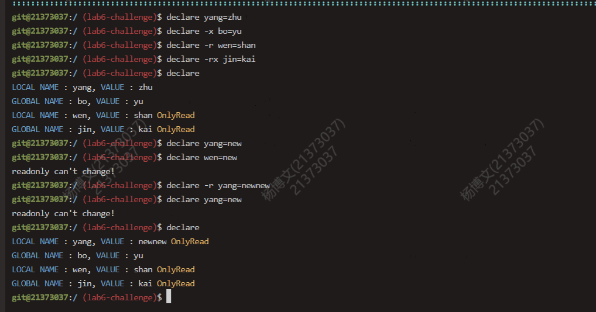

接着启动子shell进行验证，中间的空行是按了 ctrl+d 终止了子shell回到原始shell：

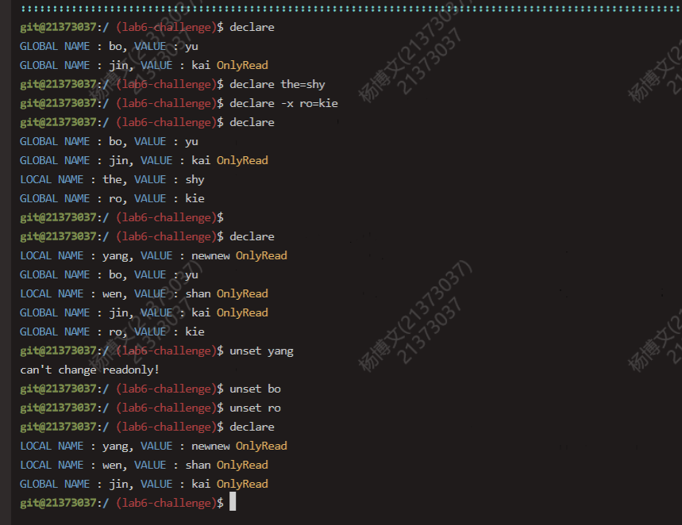

### 10.额外指令

笔者自行添加了四个最常用的指令，分别为rm，rmdir，cp，mv ，各有千秋。

一组相似的删除指令 rm 和 rmdir：
rm：删除文件； -r 递归删除目录及下级所有文件；文件若不为空则需要再次确认是否删除；-f 无需确认
rmdir: 删除空目录；-p 依次删除路径中所有空目录，例如 rmdir -p a/b/c，先判断 c 是否为空，若空则删除，再判断 b 是否为空，若空则删除，如此判断到指令开始的路径 a。

代码中已有对文件删除相关的函数，彷佛就是为额外新增指令准备的，的确适用于普通的删除操作，然而当涉及判断目录是否为空时存在漏洞。通过阅读代码我们可知，一个文件被删除，将该文件大小 ftruncate 为0，该收回的磁盘块收回，并将该文件控制块的 name 置0，然而该文件控制块并非真正被回收，这导致其父目录的文件大小不能很好的同步(值得一提的是，文件的大小是随字节数的变化而变化，而目录的大小永远都是磁盘块大小的整倍数)。即使由于这次的remove导致父目录空了，他的size仍然不为0，因此在remove的时候 f_size 便不可信，需要手动遍历该目录的进程控制块，若 name 都为0，则目录才是真的**空**了。

    int syn_dir_size(struct File *dir) {
        int r;
        u_int nblock;
        nblock = dir->f_size / BY2BLK;
        int flag = 0;
        for (int i = 0; i < nblock; i++) {
            void *blk;
            if ((r = file_get_block(dir, i, &blk)) < 0) {
                return r;
            }
            struct File *files = (struct File *)blk;
            for (struct File *f = files; f < files + FILE2BLK; ++f) {
                    if (f->f_name[0] != 0) {
                        flag = 1;
                        break;
                    }
            }
        }
        if (flag == 0) {
            return 1;
        } else {
            return 0;
        }
    }

    int file_remove(char *path, int force, int rec, int dir) {
        int r;
        struct File *f;

        // Step 1: find the file on the disk.
        if ((r = walk_path(path, 0, &f, 0)) < 0) {
            return r;
        }
        if (f->f_type == FTYPE_DIR && rec == 0 && dir == 0) {
            debugf("dir can't remove!\n");
            return -1;
        }
        if (dir == 1 && f->f_type == FTYPE_REG) {
            debugf("rmdir can't rm file!\n");
            return -1;
        }
        if (dir == 1 && f->f_type == FTYPE_DIR && syn_dir_size(f) == 0) { //0 size >0; 1 size = 0
            debugf("rmdir can't rm no empty dir!\n");
            return -1;
        }
        if (((f->f_type == FTYPE_REG && f->f_size != 0) || (f->f_type == FTYPE_DIR && syn_dir_size(f) == 0)) && force == 0 && dir == 0) {
            while (1) {
                debugf("you will delate %s, y or n? ", path);
                int c1, c2;
                c1 = syscall_cgetc();
                debugf("%c", c1);
                c2 = syscall_cgetc();
                debugf("\n");
                if ((c1 == 'y' || c1 == 'Y') && c2 == 13) {
                    break;
                } else if ((c1 == 'n' || c1 == 'N') && c2 == 13) {
                    return -1;
                } else {
                    debugf(" think more!\n");
                }
            }
        }
        // Step 2: truncate it's size to zero.
        file_truncate(f, 0); //只是把当前文件的内容清空 若上层父目录由于此次删除导致文件夹目录也为空 则并没有对父目录进行减小文件大小操作
        
        // Step 3: clear it's name.
        f->f_name[0] = '\0';

        // Step 4: flush the file.
        file_flush(f);
        if (f->f_dir) {
            file_flush(f->f_dir);
        }
        return 0;
    }

    free_block新增：
    memset((void *)diskaddr(blockno), 0, BY2PG);
    write_block(blockno);

验证如下：

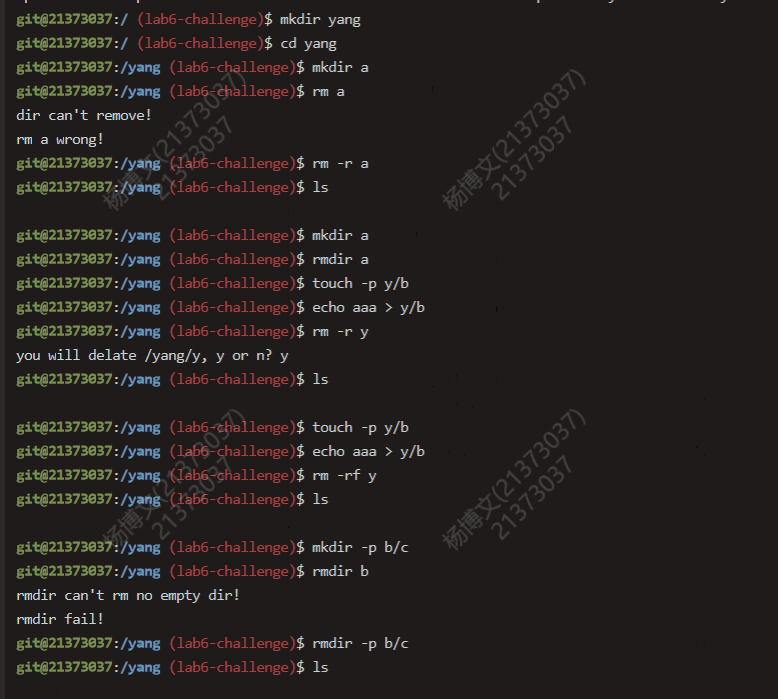

接下来又是一组颇为相似的 cp，mv 指令，可能出现的情况总结如下。

* 文件 -> 存在的文件 改写文件名
* 文件 -> 存在的目录 放在该目录底下
* 文件 -> 不存在的路径 合法情况下 默认touch文件 改写文件名
* 目录 -> 不存在的路径 合法情况下 默认mkdir目录 改写目录名
* 目录 -> 存在的目录 放在该目录底下
* 目录 -> 存在的文件 非法
* 不存在的路径 -> 任何路径 非法
  
cp若复制目录需使用 -r 选项，mv 则不需要。

cp 指令涉及到深克隆，即要完成对目录的递归拷贝，在深克隆时应注意目录与文件的区别以及进程控制块中变与不变的地方。

mv 实现并不难，完成对文件控制块的**偷天换日**即可。

    void copy_deep(struct File *file, struct File *targetf) { //dir都是整倍数 reg未必整倍数
        int nblock = targetf->f_size / BY2BLK;
        if (targetf->f_size % BY2BLK != 0) {
            nblock++;
        }
        strcpy(file->f_name, targetf->f_name);
        file->f_size = targetf->f_size;
        file->f_type = targetf->f_type;
        int r;
        void *blk, *blk1;
        for (int i = 0; i < nblock; i++) {
            if ((r = file_get_block(targetf, i, &blk)) < 0) {
                debugf("can't get targetf!\n");
                return;
            }
            if ((r = file_get_block(file, i, &blk1)) < 0) {
                debugf("can't get file!\n");
                return;
            }
            if (targetf->f_type == FTYPE_REG) {
                memcpy(blk1, blk, BY2PG);
            } else if (targetf->f_type == FTYPE_DIR) {
                struct File *files = (struct File *)blk;
                for (struct File *f = files; f < files + FILE2BLK; ++f) {
                    if (f->f_name[0] != 0) {
                        struct File *newfile;
                        dir_alloc_file(file, &newfile); //父子绑定
                        copy_deep(newfile, f);
                    }
                }
            }
        }
        return;
    }

            
    int copy(char *name, char *path, int n) { //前提 必须都已经存在 复制根目录？
        struct File *target2, *file, *targetf, *tmp;
        walk_path(path, 0, &target2, 0);
        walk_path(name, 0, &targetf, 0);
        if ((target2->f_type == FTYPE_REG && targetf->f_type == FTYPE_REG) || (target2->f_type == FTYPE_DIR && targetf->f_type == FTYPE_DIR && n == 1)) {
            char tmp[1024];
            strcpy(tmp, target2->f_name);
            copy_deep(target2, targetf);
            strcpy(target2->f_name, tmp);
            return 0;
        }
        int r = dir_lookup(target2, targetf->f_name, &tmp); //先查看目标目录下有无同名文件
        if (r != -E_NOT_FOUND) {
            debugf("%s has same name file %s!\n", path, name);
            return -1;
        }
        dir_alloc_file(target2, &file);
        copy_deep(file, targetf);
        return 0;
    }

    int move(char *name, char *path, int n) {
        struct File *target2, *targetf, *file, *tmp;
        walk_path(path, 0, &target2, 0);
        walk_path(name, 0, &targetf, 0);
        if ((target2->f_type == FTYPE_REG && targetf->f_type == FTYPE_REG) || (target2->f_type == FTYPE_DIR && targetf->f_type == FTYPE_DIR && n == 1)) {
            target2->f_size = targetf->f_size;
            for (int i = 0; i < NDIRECT; i++) {
                target2->f_direct[i] = targetf->f_direct[i];
            }
            target2->f_indirect = targetf->f_indirect;
            targetf->f_name[0] = 0;
            return 0;
        }
        int r = dir_lookup(target2, targetf->f_name, &tmp);
        if (r != -E_NOT_FOUND) {
            debugf("%s has same name file %s!\n", path, name);
            return -1;
        }
        dir_alloc_file(target2, &file);
        memcpy(file, targetf, BY2FILE);
        file->f_dir = target2;
        targetf->f_name[0] = 0;
        return 0;
    }

mv验证：

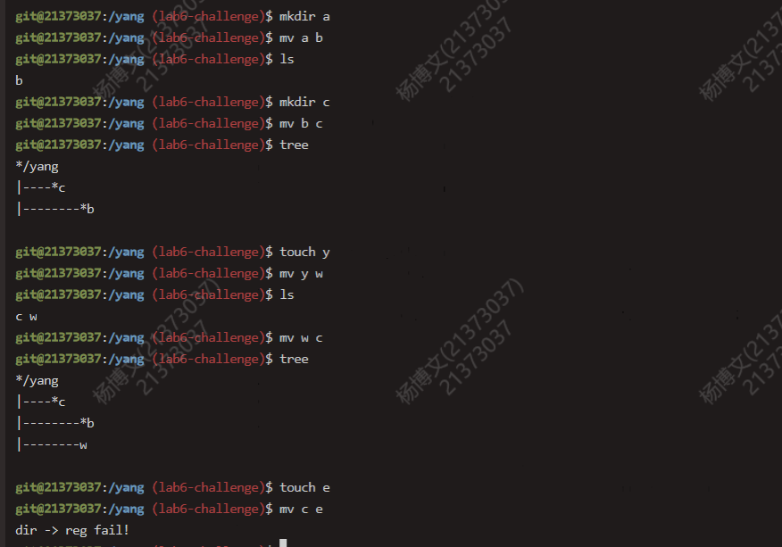

cp验证：

原有代码的 remove 实现存在些许问题(也许是没有打算令大家实现 remove 操作，总之无论如何，在 remove 后应当对磁盘中相关内容进行同步，同时在释放缓存块时，若不解除映射的话，应该要将页清空。

### 11.命令自动补全

使用tab键进行代码补全，添加的比较仓促，可以支持命令的补全和路径的补全，但只限于存在唯一解的情况，倘若前缀有多个匹配项则无能为力，但可以支持将所有匹配项打印出来用于提醒(连按两下 tab)。

    char cmd[1024][16] = {"cd", "pwd", "mv", "cp", "rm", "rmdir", "touch", "mkdir", "tree", "declare", "unset", "cat", "echo", "sh", "ls"};
    int cmd_cnt = 15;
    char level[1024][64];
    char may[1024][10];
    int may_cnt;
    int level_cnt;
    void search_maybe_string(char *s, int n) {
        //n = 0 代表搜cmd和Level，n = 1代表前面有/ 只搜索level
        may_cnt = 0;
        if (strlen(s) == 0) {
            return;
        }
        char tmp1[1024];
        for (int j = 0; j < level_cnt; j++) {
            strcpy(tmp1, level[j]);
            tmp1[strlen(s)] = 0;
            if (strcmp(tmp1, s) == 0) {
                strcpy(may[may_cnt], level[j]);
                may_cnt++;
            }
        }
        if (n == 0) {
            for (int j = 0; j < 15; j++) {
                //debugf("cmd[j] %s\n", cmd[j]);
                strcpy(tmp1, cmd[j]);
                tmp1[strlen(s)] = 0;
                if (strcmp(tmp1, s) == 0) {
                    strcpy(may[may_cnt], cmd[j]);
                    may_cnt++;
                }
            }
        }
    }

    void get_level(char *path) {
        int fd, r, n;
        level_cnt = 0;
        struct Stat st;
        struct File f;
        if ((r = stat(path, &st)) < 0) {
            return;
        }
        if (!st.st_isdir) {
            return;
        } else {
            fd = open(path, O_RDONLY);
            while ((n = readn(fd, &f, sizeof f)) == sizeof f) {
                if (f.f_name[0]) {
                    strcpy(level[level_cnt], f.f_name);
                    level_cnt++;
                }
            }
        }
        return;
    }

        当识别到 TAB 时，仍然是一通对字符串的操作：
        if (buf[i] == 9) {
			if (flag == 1) {
				debugf("\nyou maybe want: ");
				for (int j = 0; j < may_cnt; j++) {
        	                        debugf("%s ", may[j]);
	                        }
				debugf("\n");
				buf1[0] = 0; //封0
				return;
			}
			flag = 1;
			char search_path[1024];
			char lack_str[1024];
			char para1[1024];
			int tmp1 = pointer, firstcut = pointer;
			int i1;
			int mode = 0;
			for (; buf1[firstcut] != ' ' && buf1[firstcut] != '/' && firstcut >= 0; firstcut--) {
			}
			if (buf1[firstcut] == '/') {
				mode = 1;
			}
			firstcut++;
			for (; buf1[tmp1] != ' ' && tmp1 >= 0; tmp1--) {
			}
			for (i1 = 0, tmp1 = tmp1 + 1; tmp1 < pointer; tmp1++, i1++) {
				para1[i1] = buf1[tmp1];
			} 
			para1[i1] = 0;
			char *t = parsepath(path_switch(para1)); // /yang/b
			for (i1 = strlen(t); t[i1] != '/'; i1--) {
			}
			strcpy(lack_str, t + i1 + 1);
			t[i1] = 0;
			strcpy(search_path, t);
			if (search_path[0] == 0) {
				search_path[0] = '/';
				search_path[1] = 0;
			}
			get_level(search_path);
			search_maybe_string(lack_str, mode);
			for (i1 = 0; i1 < may_cnt; i1++) {
				//debugf("%s\n", may[i1]);
			}
			if (may_cnt == 1) { //有唯一解
				int diff = strlen(may[0]) - strlen(lack_str);
				char tmp[128];
				strcpy(tmp, buf1 + pointer);
				strcpy(buf1 + firstcut, may[0]);
				strcpy(buf1 + firstcut + strlen(may[0]), tmp);
				for (int k = firstcut; k < pointer; k++) {
					debugf("\b");
				}
				for (int k = 0; k < strlen(may[0]); k++) {
					debugf("%c", may[0][k]);
				}
				for (int k = 0; k < strlen(tmp); k++) {
					debugf("%c", tmp[k]);
				}
				for (int k = 0; k < strlen(tmp); k++) {
					debugf("\b");
				}
				pointer = pointer + diff;
                                max = max + diff;
			}
			continue;
		}

## 三.实验难点

本任务的验证无需一段C代码，而是通过人机交互验证，做起来较为方便且直观。

可以通过代码看出，笔者在实现指令基本功能之外，还在两个方面额外做出了大量工作，第一是指令执行异常时提醒，针对不同的错误情况会输出不同的信息进行提醒，以mkdir为例，当指定路径是一个普通文件时，会提醒“target is a reg file!”，当没有使用 -p 还企图创建多级目录时，会提醒“can't find dir : %s!”；第二便是指令子选项 [-x] 的实现，比如 rm 的 -rf，mkdir，touch 的 -p 等。用户可根据实际需要自由选择想要使用的功能，若错误使用也会出现相应的错误信息进行提醒，十分人性化。

笔者认为 LAB6-challenge 核心挑战点在于**对于字符串的操作与理解**，**对于文件系统与磁盘的各功能的理解与组合**，**对C语言底层逻辑诸如指针和内存间联系的理解**，以及**由于人工输入导致的输入多样性，涉及到的多种情况的处理**，像是oo的第三单元异常处理一样（比如输入路径时结尾带不带/，路径能否被找到，若指令执行出错则是由于哪种错误等等）。shell 重点是人机交互，因此在保证正确性的前提下保证用户的体验是至关重要的，对于既是开发者又是用户的我来说，体感良好。

对于指令的添加，重点难点在于理解 fs.c 中写好的函数，比如 dir_lookup，file_block_walk，file_get_block 等，静下心来去思考每个函数的用途，只要将这些核心函数拼装再进行小小改造，即可实现绝大部分的功能。

笔者一直对于 mos 模拟的磁盘抱有疑问，磁盘在退出后为何不能保留 shell 交互时对磁盘文件的改变。现在的理解是，模拟磁盘终究只是模拟，在上电交互时会保持同步，然而退出后下次会重新初始化磁盘，一开始装载的文件存放在 fs/Makefile 中，可通过修改 Makefile 来调整装载进磁盘的文件。
    
    fs/Makefile:
    FSIMGFILES  := rootfs/motd rootfs/newmotd $(USERAPPS) $(fs-files)

## 四.实验总结

随着挑战性任务的结束，北航操作系统课程终将迎来尾声，在这一学期中，从学习Linux，到启动 mos 操作系统，再到内存管理，进程管理，系统调用，文件系统，shell，基于以往的LAB层层递进，课程设计合理(不愧是计院老三样)，在这一步一个脚印的学习中笔者收获到大量的OS知识，以及对C语言狠狠的查缺补漏了一番。后面的LAB往往要用到前面LAB的内容，有时候你正在写的这部分内容不知道有什么用处，然而等到了下次下下次，当上下文产生联系时你便会豁然开朗，尤其是选择LAB6挑战性任务的笔者更加有体会，在实现 shell 的功能时，要与进程控制块打交道，要与系统调用与进程间通信打交道，更多的要与文件系统打交道，这令我更加理解了由低至高的OS层次架构。

本次实验共用时30h+，在你6并不算繁忙的期末周里，有着足够的时间去静下心去钻研去思考，经常一写一debug就忘记了时间。至于为何选择LAB6挑战性任务，一方面是因为刚刚写完LAB6，认为对其印象更为深刻，另一方面则是认为LAB6的实验效果更为直观，且可以阶段性进行测试，频繁激发自己的成就感，也正是这种成就感会成为我继续完成更多额外工作的动力。诚然，本实验不像其余实验过多的接触内核，实现一套新的算法机制，这一点比较可惜，如果有时间的话很想把每个挑战性任务都完成一遍，但无论如何，笔者在LAB6挑战性任务中耗费了大量的心血，甚至一度找到了当年几个日夜写 P8 的感觉，痛并快乐着的时光总是弥足珍贵。

最后再次感谢一学期以来在OS理论与实验上帮助过我的老师，助教，伙伴们，感谢你们的倾囊相授，也感谢自己坚持到了最后，若如有机会，我也愿意把自己的所学传递给更多的人。
                                                        